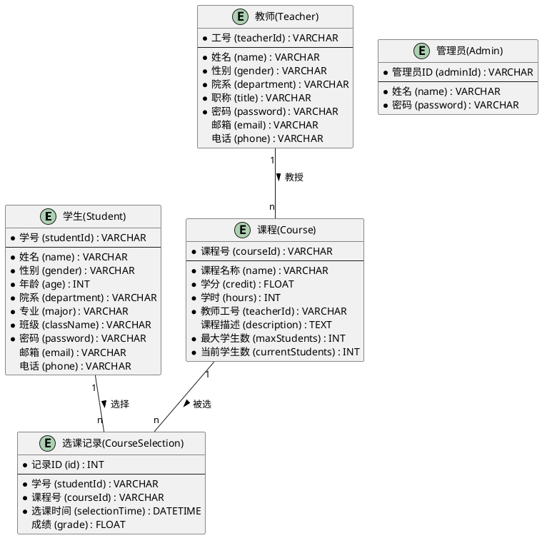

# 学生选课管理系统 - 数据库设计

## 1. 概念设计

### 1.1 E-R图



### 1.2 实体说明

1. **学生(Student)**：表示在校学生，包含学生的基本信息。
2. **教师(Teacher)**：表示学校教师，包含教师的基本信息。
3. **管理员(Admin)**：表示系统管理员。
4. **课程(Course)**：表示学校开设的课程，包含课程的基本信息。
5. **选课记录(CourseSelection)**：表示学生选课的记录，是学生和课程之间的关联表。

### 1.3 关系说明

1. **学生-选课记录**：一个学生可以选择多门课程（一对多关系）。
2. **课程-选课记录**：一门课程可以被多个学生选择（一对多关系）。
3. **教师-课程**：一个教师可以教授多门课程（一对多关系）。

## 2. 逻辑设计

### 2.1 表结构设计

#### 学生表(student)

| 字段名 | 数据类型 | 长度 | 允许空 | 主键 | 外键 | 默认值 | 说明 |
| ----- | ------- | ---- | ----- | ---- | ---- | ----- | ---- |
| student_id | VARCHAR | 20 | 否 | 是 | | | 学号，主键 |
| name | VARCHAR | 50 | 否 | | | | 姓名 |
| gender | VARCHAR | 10 | 否 | | | | 性别 |
| age | INT | | 否 | | | | 年龄 |
| department | VARCHAR | 100 | 否 | | | | 院系 |
| major | VARCHAR | 100 | 否 | | | | 专业 |
| class_name | VARCHAR | 100 | 否 | | | | 班级 |
| password | VARCHAR | 100 | 否 | | | | 密码（加密存储） |
| email | VARCHAR | 100 | 是 | | | NULL | 邮箱 |
| phone | VARCHAR | 20 | 是 | | | NULL | 电话号码 |

#### 教师表(teacher)

| 字段名 | 数据类型 | 长度 | 允许空 | 主键 | 外键 | 默认值 | 说明 |
| ----- | ------- | ---- | ----- | ---- | ---- | ----- | ---- |
| teacher_id | VARCHAR | 20 | 否 | 是 | | | 工号，主键 |
| name | VARCHAR | 50 | 否 | | | | 姓名 |
| gender | VARCHAR | 10 | 否 | | | | 性别 |
| department | VARCHAR | 100 | 否 | | | | 院系 |
| title | VARCHAR | 50 | 否 | | | | 职称 |
| password | VARCHAR | 100 | 否 | | | | 密码（加密存储） |
| email | VARCHAR | 100 | 是 | | | NULL | 邮箱 |
| phone | VARCHAR | 20 | 是 | | | NULL | 电话号码 |

#### 管理员表(admin)

| 字段名 | 数据类型 | 长度 | 允许空 | 主键 | 外键 | 默认值 | 说明 |
| ----- | ------- | ---- | ----- | ---- | ---- | ----- | ---- |
| admin_id | VARCHAR | 20 | 否 | 是 | | | 管理员ID，主键 |
| name | VARCHAR | 50 | 否 | | | | 姓名 |
| password | VARCHAR | 100 | 否 | | | | 密码（加密存储） |

#### 课程表(course)

| 字段名 | 数据类型 | 长度 | 允许空 | 主键 | 外键 | 默认值 | 说明 |
| ----- | ------- | ---- | ----- | ---- | ---- | ----- | ---- |
| course_id | VARCHAR | 20 | 否 | 是 | | | 课程号，主键 |
| name | VARCHAR | 100 | 否 | | | | 课程名称 |
| credit | FLOAT | | 否 | | | | 学分 |
| hours | INT | | 否 | | | | 学时 |
| teacher_id | VARCHAR | 20 | 否 | | 是 | | 教师工号，外键 |
| description | TEXT | | 是 | | | NULL | 课程描述 |
| max_students | INT | | 否 | | | 0 | 最大学生数 |
| current_students | INT | | 否 | | | 0 | 当前学生数 |

#### 选课记录表(course_selection)

| 字段名 | 数据类型 | 长度 | 允许空 | 主键 | 外键 | 默认值 | 说明 |
| ----- | ------- | ---- | ----- | ---- | ---- | ----- | ---- |
| id | INT | | 否 | 是 | | | 记录ID，自增主键 |
| student_id | VARCHAR | 20 | 否 | | 是 | | 学号，外键 |
| course_id | VARCHAR | 20 | 否 | | 是 | | 课程号，外键 |
| selection_time | DATETIME | | 否 | | | CURRENT_TIMESTAMP | 选课时间 |
| grade | FLOAT | | 是 | | | NULL | 成绩 |

### 2.2 约束设计

#### 主键约束

- `student`表：`student_id`为主键
- `teacher`表：`teacher_id`为主键
- `admin`表：`admin_id`为主键
- `course`表：`course_id`为主键
- `course_selection`表：`id`为主键

#### 外键约束

- `course`表：`teacher_id`外键引用`teacher`表的`teacher_id`
- `course_selection`表：`student_id`外键引用`student`表的`student_id`
- `course_selection`表：`course_id`外键引用`course`表的`course_id`

#### 唯一约束

- `student`表：`student_id`唯一
- `teacher`表：`teacher_id`唯一
- `admin`表：`admin_id`唯一
- `course`表：`course_id`唯一
- `course_selection`表：(`student_id`, `course_id`)联合唯一，确保一个学生不能重复选同一门课

#### 非空约束

- 所有表的主键字段都不允许为空
- 大部分基本信息字段（如姓名、性别等）不允许为空
- 选课记录的学号、课程号和选课时间不允许为空

#### 默认值约束

- `course`表：`max_students`默认为0
- `course`表：`current_students`默认为0
- `course_selection`表：`selection_time`默认为当前时间戳

### 2.3 索引设计

#### 主键索引

- `student`表：`student_id`
- `teacher`表：`teacher_id`
- `admin`表：`admin_id`
- `course`表：`course_id`
- `course_selection`表：`id`

#### 外键索引

- `course`表：`teacher_id`
- `course_selection`表：`student_id`
- `course_selection`表：`course_id`

#### 其他索引

- `course_selection`表：(`student_id`, `course_id`)组合索引，加快选课查询
- `course`表：`name`索引，加快课程名称查询
- `student`表：`name`索引，加快学生姓名查询
- `teacher`表：`name`索引，加快教师姓名查询

## 3. 物理设计

### 3.1 创建数据库

```sql
CREATE DATABASE student_course_system CHARACTER SET utf8mb4 COLLATE utf8mb4_unicode_ci;

USE student_course_system;
```

### 3.2 创建表

#### 学生表

```sql
CREATE TABLE student (
    student_id VARCHAR(20) NOT NULL COMMENT '学号',
    name VARCHAR(50) NOT NULL COMMENT '姓名',
    gender VARCHAR(10) NOT NULL COMMENT '性别',
    age INT NOT NULL COMMENT '年龄',
    department VARCHAR(100) NOT NULL COMMENT '院系',
    major VARCHAR(100) NOT NULL COMMENT '专业',
    class_name VARCHAR(100) NOT NULL COMMENT '班级',
    password VARCHAR(100) NOT NULL COMMENT '密码',
    email VARCHAR(100) DEFAULT NULL COMMENT '邮箱',
    phone VARCHAR(20) DEFAULT NULL COMMENT '电话',
    PRIMARY KEY (student_id),
    INDEX idx_student_name (name)
) ENGINE=InnoDB DEFAULT CHARSET=utf8mb4 COMMENT='学生表';
```

#### 教师表

```sql
CREATE TABLE teacher (
    teacher_id VARCHAR(20) NOT NULL COMMENT '工号',
    name VARCHAR(50) NOT NULL COMMENT '姓名',
    gender VARCHAR(10) NOT NULL COMMENT '性别',
    department VARCHAR(100) NOT NULL COMMENT '院系',
    title VARCHAR(50) NOT NULL COMMENT '职称',
    password VARCHAR(100) NOT NULL COMMENT '密码',
    email VARCHAR(100) DEFAULT NULL COMMENT '邮箱',
    phone VARCHAR(20) DEFAULT NULL COMMENT '电话',
    PRIMARY KEY (teacher_id),
    INDEX idx_teacher_name (name)
) ENGINE=InnoDB DEFAULT CHARSET=utf8mb4 COMMENT='教师表';
```

#### 管理员表

```sql
CREATE TABLE admin (
    admin_id VARCHAR(20) NOT NULL COMMENT '管理员ID',
    name VARCHAR(50) NOT NULL COMMENT '姓名',
    password VARCHAR(100) NOT NULL COMMENT '密码',
    PRIMARY KEY (admin_id)
) ENGINE=InnoDB DEFAULT CHARSET=utf8mb4 COMMENT='管理员表';
```

#### 课程表

```sql
CREATE TABLE course (
    course_id VARCHAR(20) NOT NULL COMMENT '课程号',
    name VARCHAR(100) NOT NULL COMMENT '课程名称',
    credit FLOAT NOT NULL COMMENT '学分',
    hours INT NOT NULL COMMENT '学时',
    teacher_id VARCHAR(20) NOT NULL COMMENT '教师工号',
    description TEXT DEFAULT NULL COMMENT '课程描述',
    max_students INT NOT NULL DEFAULT 0 COMMENT '最大学生数',
    current_students INT NOT NULL DEFAULT 0 COMMENT '当前学生数',
    PRIMARY KEY (course_id),
    INDEX idx_course_name (name),
    INDEX idx_teacher_id (teacher_id),
    CONSTRAINT fk_course_teacher FOREIGN KEY (teacher_id) REFERENCES teacher (teacher_id) ON DELETE RESTRICT ON UPDATE CASCADE
) ENGINE=InnoDB DEFAULT CHARSET=utf8mb4 COMMENT='课程表';
```

#### 选课记录表

```sql
CREATE TABLE course_selection (
    id INT AUTO_INCREMENT NOT NULL COMMENT '记录ID',
    student_id VARCHAR(20) NOT NULL COMMENT '学号',
    course_id VARCHAR(20) NOT NULL COMMENT '课程号',
    selection_time DATETIME NOT NULL DEFAULT CURRENT_TIMESTAMP COMMENT '选课时间',
    grade FLOAT DEFAULT NULL COMMENT '成绩',
    PRIMARY KEY (id),
    UNIQUE KEY uk_student_course (student_id, course_id),
    INDEX idx_student_id (student_id),
    INDEX idx_course_id (course_id),
    CONSTRAINT fk_selection_student FOREIGN KEY (student_id) REFERENCES student (student_id) ON DELETE CASCADE ON UPDATE CASCADE,
    CONSTRAINT fk_selection_course FOREIGN KEY (course_id) REFERENCES course (course_id) ON DELETE RESTRICT ON UPDATE CASCADE
) ENGINE=InnoDB DEFAULT CHARSET=utf8mb4 COMMENT='选课记录表';
```

## 4. 类设计映射表

| 类名 | 表名 | 类属性 | 表字段 | 数据类型 |
| ---- | ---- | ------ | ------ | ------- |
| Student | student | studentId | student_id | VARCHAR(20) |
| Student | student | name | name | VARCHAR(50) |
| Student | student | gender | gender | VARCHAR(10) |
| Student | student | age | age | INT |
| Student | student | department | department | VARCHAR(100) |
| Student | student | major | major | VARCHAR(100) |
| Student | student | className | class_name | VARCHAR(100) |
| Student | student | password | password | VARCHAR(100) |
| Student | student | email | email | VARCHAR(100) |
| Student | student | phone | phone | VARCHAR(20) |
| Teacher | teacher | teacherId | teacher_id | VARCHAR(20) |
| Teacher | teacher | name | name | VARCHAR(50) |
| Teacher | teacher | gender | gender | VARCHAR(10) |
| Teacher | teacher | department | department | VARCHAR(100) |
| Teacher | teacher | title | title | VARCHAR(50) |
| Teacher | teacher | password | password | VARCHAR(100) |
| Teacher | teacher | email | email | VARCHAR(100) |
| Teacher | teacher | phone | phone | VARCHAR(20) |
| Admin | admin | adminId | admin_id | VARCHAR(20) |
| Admin | admin | name | name | VARCHAR(50) |
| Admin | admin | password | password | VARCHAR(100) |
| Course | course | courseId | course_id | VARCHAR(20) |
| Course | course | name | name | VARCHAR(100) |
| Course | course | credit | credit | FLOAT |
| Course | course | hours | hours | INT |
| Course | course | teacherId | teacher_id | VARCHAR(20) |
| Course | course | description | description | TEXT |
| Course | course | maxStudents | max_students | INT |
| Course | course | currentStudents | current_students | INT |
| CourseSelection | course_selection | id | id | INT |
| CourseSelection | course_selection | studentId | student_id | VARCHAR(20) |
| CourseSelection | course_selection | courseId | course_id | VARCHAR(20) |
| CourseSelection | course_selection | selectionTime | selection_time | DATETIME |
| CourseSelection | course_selection | grade | grade | FLOAT | 