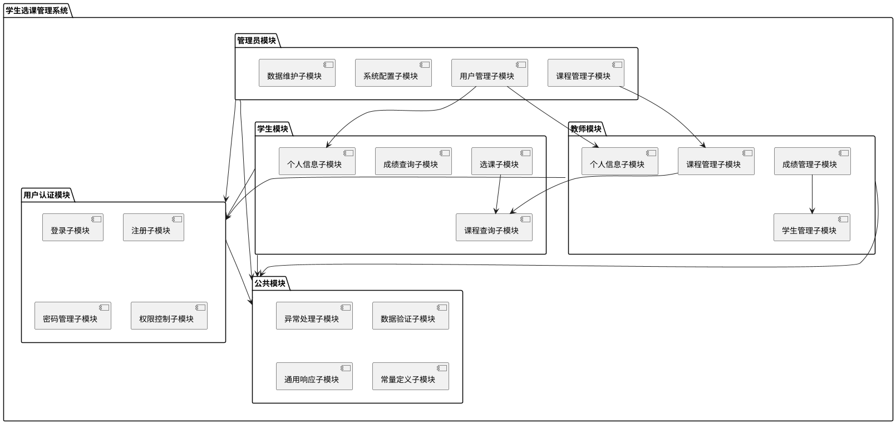

# 学生选课管理系统 - 功能模块设计

## 1. 系统功能模块结构

学生选课管理系统采用模块化设计，各个模块之间相对独立但又有机协作，系统整体功能模块结构如下：

```
+-------------------------------------------+
|             学生选课管理系统              |
+-------------------------------------------+
           |         |        |        |
+----------v---+ +---v------+ +---v---+ +---v------+
| 用户认证模块 | | 学生模块 | |教师模块| |管理员模块|
+----------+---+ +---+------+ +---+---+ +---+------+
           |         |        |        |
+----------v---+ +---v------+ +---v---+ +---v------+
|   公共模块   | | 工具模块 | |消息模块| |日志模块  |
+----------+---+ +---+------+ +---+---+ +---+------+
```

## 2. 核心功能模块设计

### 2.1 用户认证模块

#### 2.1.1 模块职责

负责系统的用户身份验证、授权和会话管理，包括登录、注册、密码找回等功能。

#### 2.1.2 包含的子模块

1. **登录子模块**
   - 处理各类用户（学生、教师、管理员）的登录请求
   - 验证用户身份
   - 生成JWT令牌
   
2. **注册子模块**
   - 处理学生注册请求
   - 验证注册信息
   - 创建新用户

3. **密码管理子模块**
   - 密码重置
   - 密码修改
   - 密码加密

4. **权限控制子模块**
   - 基于角色的访问控制
   - API访问权限验证
   - 页面权限控制

#### 2.1.3 接口设计

| 接口名称 | 请求方法 | 路径 | 功能描述 | 参数 | 返回值 |
|---------|---------|-----|----------|------|-------|
| login | POST | /api/auth/login | 用户登录 | {userType, username, password} | {token, userInfo} |
| register | POST | /api/auth/register | 用户注册 | {userInfo} | {success, message} |
| resetPassword | POST | /api/auth/password/reset | 重置密码 | {username, email} | {success, message} |
| changePassword | PUT | /api/auth/password/change | 修改密码 | {oldPassword, newPassword} | {success, message} |

#### 2.1.4 类设计

```java
public class AuthController {
    private AuthService authService;
    
    public Result login(LoginRequest request);
    public Result register(RegisterRequest request);
    public Result resetPassword(ResetPasswordRequest request);
    public Result changePassword(ChangePasswordRequest request);
}

public class AuthService {
    private UserRepository userRepository;
    private JwtUtils jwtUtils;
    
    public LoginResponse login(String userType, String username, String password);
    public RegisterResponse register(UserDTO userDTO);
    public boolean resetPassword(String username, String email);
    public boolean changePassword(String username, String oldPassword, String newPassword);
}
```

### 2.2 学生模块

#### 2.2.1 模块职责

为学生用户提供课程查询、选课、退课、成绩查询等功能。

#### 2.2.2 包含的子模块

1. **选课子模块**
   - 查询可选课程
   - 课程筛选和搜索
   - 选课操作
   - 退课操作

2. **课程查询子模块**
   - 已选课程查询
   - 课程详情查看
   - 选课历史查询

3. **成绩查询子模块**
   - 课程成绩查询
   - 学期成绩统计
   - 绩点计算

4. **个人信息子模块**
   - 个人资料查看
   - 个人资料修改
   - 密码修改

#### 2.2.3 接口设计

| 接口名称 | 请求方法 | 路径 | 功能描述 | 参数 | 返回值 |
|---------|---------|-----|----------|------|-------|
| getAvailableCourses | GET | /api/courses/available | 获取可选课程列表 | {page, size, filters} | {courses, pagination} |
| selectCourse | POST | /api/selections | 选择课程 | {studentId, courseId} | {success, message} |
| dropCourse | DELETE | /api/selections/{id} | 退选课程 | {id} | {success, message} |
| getSelectedCourses | GET | /api/students/{id}/courses | 获取已选课程 | {studentId} | {courses} |
| getGrades | GET | /api/students/{id}/grades | 获取成绩 | {studentId, semester} | {grades, statistics} |
| updateProfile | PUT | /api/students/{id} | 更新个人资料 | {studentInfo} | {success, message} |

#### 2.2.4 类设计

```java
public class StudentController {
    private StudentService studentService;
    private CourseService courseService;
    private SelectionService selectionService;
    
    public Result getAvailableCourses(CourseQueryRequest request);
    public Result selectCourse(SelectionRequest request);
    public Result dropCourse(Long id);
    public Result getSelectedCourses(String studentId);
    public Result getGrades(String studentId, String semester);
    public Result updateProfile(String studentId, StudentDTO studentDTO);
}

public class StudentService {
    private StudentRepository studentRepository;
    
    public Student getStudentById(String studentId);
    public boolean updateStudent(Student student);
    public Page<Student> queryStudents(StudentQueryDTO queryDTO);
}

public class SelectionService {
    private CourseSelectionRepository selectionRepository;
    private CourseService courseService;
    
    public boolean selectCourse(String studentId, String courseId);
    public boolean dropCourse(Long selectionId);
    public List<CourseSelection> getStudentSelections(String studentId);
    public List<CourseSelection> getCourseSelections(String courseId);
    public List<Grade> getStudentGrades(String studentId, String semester);
}
```

### 2.3 教师模块

#### 2.3.1 模块职责

为教师用户提供课程管理、学生管理、成绩管理等功能。

#### 2.3.2 包含的子模块

1. **课程管理子模块**
   - 创建课程
   - 更新课程信息
   - 查看课程列表
   - 查看课程详情

2. **学生管理子模块**
   - 查看选课学生列表
   - 查询学生信息

3. **成绩管理子模块**
   - 录入学生成绩
   - 修改学生成绩
   - 成绩统计分析
   - 成绩导入导出

4. **个人信息子模块**
   - 个人资料查看
   - 个人资料修改
   - 密码修改

#### 2.3.3 接口设计

| 接口名称 | 请求方法 | 路径 | 功能描述 | 参数 | 返回值 |
|---------|---------|-----|----------|------|-------|
| createCourse | POST | /api/courses | 创建课程 | {courseInfo} | {success, courseId} |
| updateCourse | PUT | /api/courses/{id} | 更新课程信息 | {courseId, courseInfo} | {success, message} |
| getTeacherCourses | GET | /api/teachers/{id}/courses | 获取教师课程 | {teacherId} | {courses} |
| getCourseStudents | GET | /api/courses/{id}/students | 获取选课学生 | {courseId} | {students} |
| updateGrade | PUT | /api/selections/{id}/grade | 更新学生成绩 | {selectionId, grade} | {success, message} |
| batchUpdateGrades | PUT | /api/courses/{id}/grades | 批量更新成绩 | {courseId, grades[]} | {success, message} |
| updateTeacherProfile | PUT | /api/teachers/{id} | 更新个人资料 | {teacherId, teacherInfo} | {success, message} |

#### 2.3.4 类设计

```java
public class TeacherController {
    private TeacherService teacherService;
    private CourseService courseService;
    private SelectionService selectionService;
    
    public Result createCourse(CourseDTO courseDTO);
    public Result updateCourse(String courseId, CourseDTO courseDTO);
    public Result getTeacherCourses(String teacherId);
    public Result getCourseStudents(String courseId);
    public Result updateGrade(Long selectionId, Float grade);
    public Result batchUpdateGrades(String courseId, List<GradeDTO> grades);
    public Result updateProfile(String teacherId, TeacherDTO teacherDTO);
}

public class TeacherService {
    private TeacherRepository teacherRepository;
    
    public Teacher getTeacherById(String teacherId);
    public boolean updateTeacher(Teacher teacher);
    public Page<Teacher> queryTeachers(TeacherQueryDTO queryDTO);
}

public class CourseService {
    private CourseRepository courseRepository;
    
    public Course createCourse(Course course);
    public boolean updateCourse(Course course);
    public boolean deleteCourse(String courseId);
    public Course getCourseById(String courseId);
    public List<Course> getTeacherCourses(String teacherId);
    public Page<Course> queryCourses(CourseQueryDTO queryDTO);
    public boolean incrementStudentCount(String courseId);
    public boolean decrementStudentCount(String courseId);
}
```

### 2.4 管理员模块

#### 2.4.1 模块职责

为系统管理员提供用户管理、课程管理、系统配置等功能。

#### 2.4.2 包含的子模块

1. **用户管理子模块**
   - 学生管理（添加、修改、删除、查询）
   - 教师管理（添加、修改、删除、查询）
   - 管理员管理

2. **课程管理子模块**
   - 课程信息管理
   - 课程审核

3. **系统配置子模块**
   - 选课时间设置
   - 退课时间设置
   - 系统参数配置
   - 系统公告管理

4. **数据维护子模块**
   - 数据备份
   - 数据恢复
   - 日志查询

#### 2.4.3 接口设计

| 接口名称 | 请求方法 | 路径 | 功能描述 | 参数 | 返回值 |
|---------|---------|-----|----------|------|-------|
| getStudents | GET | /api/admin/students | 获取所有学生 | {page, size, filters} | {students, pagination} |
| createStudent | POST | /api/admin/students | 创建学生 | {studentInfo} | {success, studentId} |
| updateStudent | PUT | /api/admin/students/{id} | 更新学生信息 | {studentId, studentInfo} | {success, message} |
| deleteStudent | DELETE | /api/admin/students/{id} | 删除学生 | {studentId} | {success, message} |
| getTeachers | GET | /api/admin/teachers | 获取所有教师 | {page, size, filters} | {teachers, pagination} |
| createTeacher | POST | /api/admin/teachers | 创建教师 | {teacherInfo} | {success, teacherId} |
| updateSystem | PUT | /api/admin/system/settings | 更新系统设置 | {settings} | {success, message} |
| backupDatabase | POST | /api/admin/system/backup | 备份数据库 | {} | {success, backupId} |
| queryLogs | GET | /api/admin/system/logs | 查询系统日志 | {startTime, endTime, type} | {logs} |

#### 2.4.4 类设计

```java
public class AdminController {
    private AdminService adminService;
    private StudentService studentService;
    private TeacherService teacherService;
    private SystemService systemService;
    
    public Result getStudents(StudentQueryRequest request);
    public Result createStudent(StudentDTO studentDTO);
    public Result updateStudent(String studentId, StudentDTO studentDTO);
    public Result deleteStudent(String studentId);
    public Result getTeachers(TeacherQueryRequest request);
    public Result createTeacher(TeacherDTO teacherDTO);
    public Result updateSystem(SystemSettingsDTO settings);
    public Result backupDatabase();
    public Result queryLogs(LogQueryRequest request);
}

public class AdminService {
    private AdminRepository adminRepository;
    
    public Admin getAdminById(String adminId);
    public boolean updateAdmin(Admin admin);
}

public class SystemService {
    private SystemSettingsRepository settingsRepository;
    private LogRepository logRepository;
    private DatabaseUtils databaseUtils;
    
    public SystemSettings getSettings();
    public boolean updateSettings(SystemSettings settings);
    public String backupDatabase();
    public boolean restoreDatabase(String backupId);
    public Page<Log> queryLogs(LogQueryDTO queryDTO);
}
```

### 2.5 公共模块

#### 2.5.1 模块职责

提供系统共用的基础功能，如异常处理、数据验证、通用响应等。

#### 2.5.2 包含的子模块

1. **异常处理子模块**
   - 统一异常处理
   - 自定义异常
   
2. **数据验证子模块**
   - 输入数据验证
   - 业务规则验证
   
3. **通用响应子模块**
   - 统一响应格式
   - 响应封装

4. **常量定义子模块**
   - 系统常量
   - 错误代码
   - 业务枚举

#### 2.5.3 类设计

```java
public class Result<T> {
    private Integer code;
    private String msg;
    private T data;
    
    public static <T> Result<T> success(T data);
    public static <T> Result<T> fail(Integer code, String msg);
}

public class GlobalExceptionHandler {
    public Result handleBusinessException(BusinessException e);
    public Result handleValidationException(ValidationException e);
    public Result handleAuthorizationException(AuthorizationException e);
    public Result handleUnknownException(Exception e);
}

public class BusinessException extends RuntimeException {
    private Integer code;
    
    public BusinessException(Integer code, String message);
}

public class Constants {
    // 系统常量定义
    public static final class UserType {
        public static final String STUDENT = "student";
        public static final String TEACHER = "teacher";
        public static final String ADMIN = "admin";
    }
    
    public static final class ResponseCode {
        public static final Integer SUCCESS = 200;
        public static final Integer FAIL = 500;
        public static final Integer UNAUTHORIZED = 401;
        public static final Integer FORBIDDEN = 403;
    }
}
```

## 3. 模块间关系

### 3.1 依赖关系



### 3.2 交互关系

- **用户认证模块**：所有其他功能模块都依赖于用户认证模块进行身份验证和权限控制。
- **公共模块**：所有功能模块都使用公共模块提供的异常处理、数据验证、通用响应等基础功能。
- **学生模块**：选课子模块依赖课程查询子模块提供课程信息。
- **教师模块**：成绩管理子模块依赖学生管理子模块提供选课学生信息。
- **管理员模块**：用户管理子模块与学生和教师的个人信息子模块交互；课程管理子模块与教师的课程管理子模块交互。

## 4. 业务流程实现

### 4.1 选课流程

```
1. 学生登录 -> 用户认证模块
2. 查看可选课程 -> 课程查询子模块
3. 选择课程 -> 选课子模块
   3.1 检查课程容量 -> 课程查询子模块
   3.2 检查时间冲突 -> 选课子模块
   3.3 创建选课记录 -> 选课子模块
   3.4 更新课程人数 -> 课程管理子模块
4. 查看选课结果 -> 选课子模块
```

### 4.2 成绩录入流程

```
1. 教师登录 -> 用户认证模块
2. 查看教授课程 -> 课程查询子模块
3. 选择特定课程 -> 课程管理子模块
4. 查看选课学生 -> 学生管理子模块
5. 录入学生成绩 -> 成绩管理子模块
   5.1 输入成绩 -> 成绩管理子模块
   5.2 验证成绩 -> 数据验证子模块
   5.3 保存成绩 -> 成绩管理子模块
6. 查看成绩统计 -> 成绩管理子模块
```

### 4.3 系统配置流程

```
1. 管理员登录 -> 用户认证模块
2. 访问系统设置 -> 系统配置子模块
3. 修改选课时间 -> 系统配置子模块
4. 修改系统参数 -> 系统配置子模块
5. 保存配置 -> 系统配置子模块
```

## 5. 异常处理设计

### 5.1 异常分类

1. **业务异常 (BusinessException)**
   - 选课人数已满
   - 课程时间冲突
   - 超出选课/退课时间限制
   - 用户已存在
   - 密码不匹配
   
2. **授权异常 (AuthorizationException)**
   - 未登录
   - 权限不足
   - 令牌过期
   
3. **验证异常 (ValidationException)**
   - 参数格式错误
   - 必填字段缺失
   - 数据类型不匹配
   
4. **系统异常 (SystemException)**
   - 数据库连接失败
   - 外部服务调用失败
   - 系统资源不足

### 5.2 异常处理流程

```
1. 异常发生
2. 全局异常处理器捕获异常
3. 根据异常类型进行分类处理
4. 记录错误日志
5. 转换为统一响应格式
6. 返回给客户端
```

### 5.3 异常处理示例代码

```java
@RestControllerAdvice
public class GlobalExceptionHandler {
    
    private static final Logger logger = LoggerFactory.getLogger(GlobalExceptionHandler.class);
    
    @ExceptionHandler(BusinessException.class)
    public Result handleBusinessException(BusinessException e) {
        logger.warn("业务异常: {}", e.getMessage());
        return Result.fail(e.getCode(), e.getMessage());
    }
    
    @ExceptionHandler(AuthorizationException.class)
    public Result handleAuthorizationException(AuthorizationException e) {
        logger.warn("授权异常: {}", e.getMessage());
        return Result.fail(Constants.ResponseCode.UNAUTHORIZED, e.getMessage());
    }
    
    @ExceptionHandler(ValidationException.class)
    public Result handleValidationException(ValidationException e) {
        logger.warn("数据验证异常: {}", e.getMessage());
        return Result.fail(Constants.ResponseCode.INVALID_PARAM, e.getMessage());
    }
    
    @ExceptionHandler(Exception.class)
    public Result handleUnknownException(Exception e) {
        logger.error("系统异常: {}", e.getMessage(), e);
        return Result.fail(Constants.ResponseCode.FAIL, "系统错误，请联系管理员");
    }
}
``` 