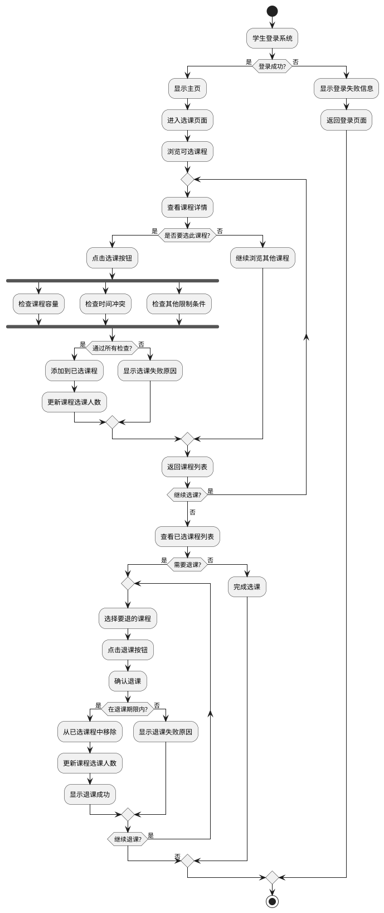
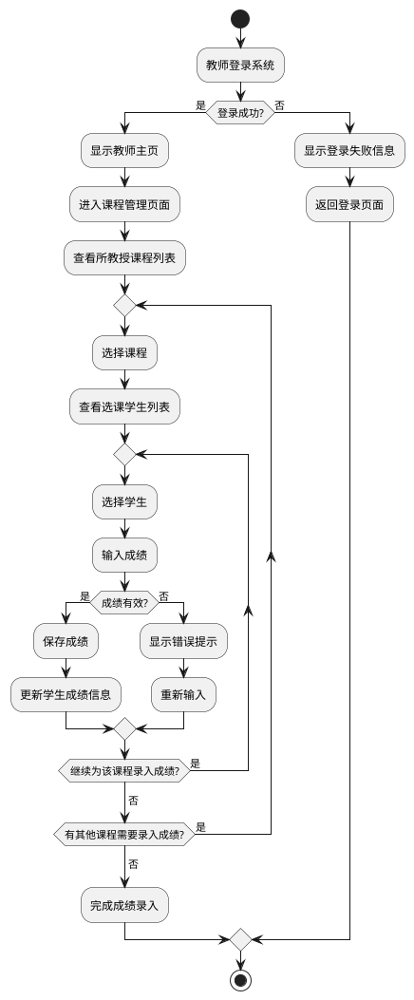

# 学生选课管理系统 - 活动图

## 学生选课流程活动图

## 教师录入成绩流程活动图

## 活动图说明

### 学生选课流程活动图

该活动图描述了学生选课的完整流程:

1. **登录流程**:
   - 学生登录系统
   - 验证登录信息
   - 如果登录失败，返回登录页面

2. **选课流程**:
   - 浏览可选课程列表
   - 查看感兴趣的课程详情
   - 决定是否选择该课程
   - 如果选择，系统并行检查课程容量、时间冲突和其他限制条件
   - 如果满足所有条件，添加到已选课程并更新课程选课人数
   - 如果不满足条件，显示选课失败原因
   - 重复上述流程直到学生不想继续选课

3. **退课流程**:
   - 查看已选课程列表
   - 选择需要退的课程
   - 确认退课
   - 系统检查是否在退课期限内
   - 如果在期限内，从已选课程中移除并更新课程选课人数
   - 如果不在期限内，显示退课失败原因
   - 重复上述流程直到学生不想继续退课

### 教师录入成绩流程活动图

该活动图描述了教师录入学生成绩的完整流程:

1. **登录流程**:
   - 教师登录系统
   - 验证登录信息
   - 如果登录失败，返回登录页面

2. **课程选择**:
   - 查看所教授的课程列表
   - 选择需要录入成绩的课程

3. **成绩录入**:
   - 查看选课学生列表
   - 为每个学生输入成绩
   - 验证成绩是否有效
   - 如果有效，保存成绩并更新学生成绩信息
   - 如果无效，显示错误提示并重新输入
   - 重复上述流程直到完成所有学生的成绩录入

4. **课程切换**:
   - 完成一门课程的成绩录入后，可以切换到其他课程
   - 重复成绩录入流程
   - 直到所有课程的成绩都已录入完成 