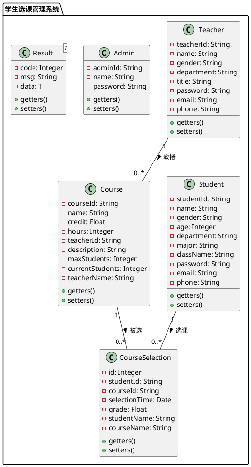

# 学生选课管理系统 - 类图

## 类关系说明

1. **学生 (Student)**：
   - 一个学生可以选择多门课程（通过CourseSelection关联）
   
2. **教师 (Teacher)**：
   - 一个教师可以教授多门课程
   
3. **课程 (Course)**：
   - 一门课程由一个教师教授
   - 一门课程可以被多个学生选择（通过CourseSelection关联）
   
4. **选课记录 (CourseSelection)**：
   - 表示学生和课程之间的多对多关系
   - 包含选课时间和学生成绩信息
   
5. **管理员 (Admin)**：
   - 负责系统的管理工作
   
6. **结果封装类 (Result)**：
   - 用于API响应的通用返回格式 