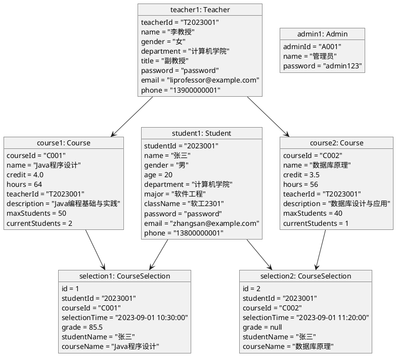

# 学生选课管理系统 - 对象图

## 对象图说明

这个对象图展示了系统中的具体实例及其关系：

1. **学生对象**：
   - 张三（student1）是一名软件工程专业的学生

2. **教师对象**：
   - 李教授（teacher1）是计算机学院的一名副教授

3. **课程对象**：
   - Java程序设计（course1）由李教授教授，学分为4.0，课时为64
   - 数据库原理（course2）也由李教授教授，学分为3.5，课时为56

4. **选课记录对象**：
   - 张三选了Java程序设计课程，并获得了85.5分
   - 张三也选了数据库原理课程，但尚未有成绩

5. **管理员对象**：
   - 系统中有一个管理员账号

该对象图展示了一个具体的选课场景，表明学生如何选择课程、教师如何教授课程以及选课后成绩记录的情况。 