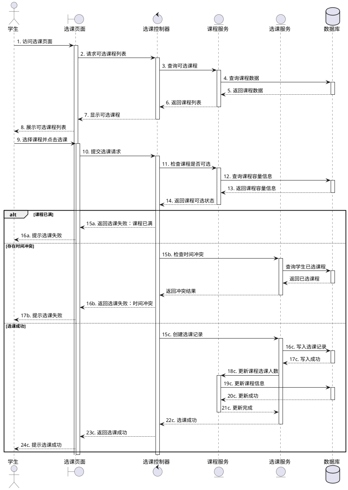
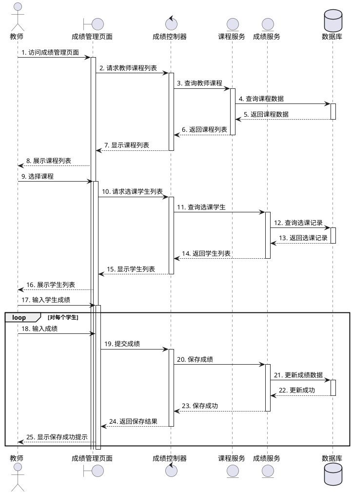
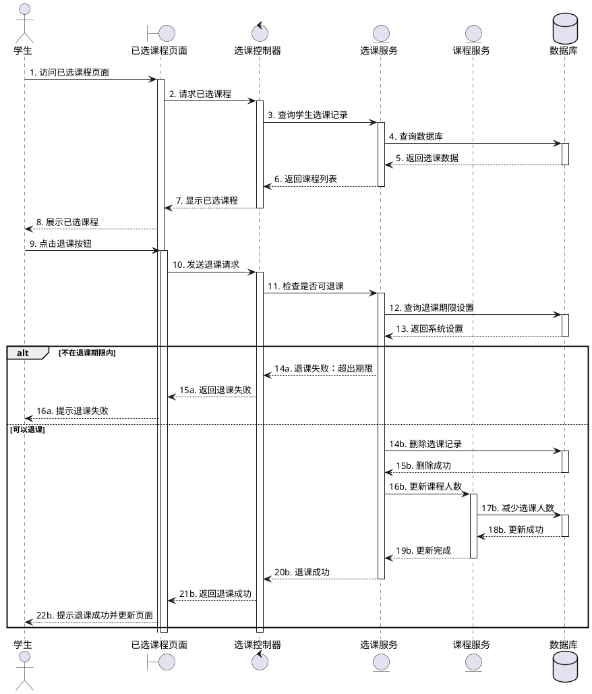

# 学生选课管理系统 - 时序图

## 1. 学生选课流程时序图

## 2. 教师录入成绩流程时序图

## 3. 学生退课流程时序图

## 时序图说明

### 学生选课流程

1. **发起请求阶段**:
   - 学生访问选课页面，系统通过控制器访问课程服务
   - 从数据库获取可选课程数据并显示给学生

2. **选课操作阶段**:
   - 学生选择课程并提交选课请求
   - 系统先检查课程容量是否已满
   - 然后检查是否存在时间冲突
   - 如满足选课条件，则创建选课记录

3. **结果处理阶段**:
   - 更新课程选课人数
   - 返回选课结果给学生（成功或失败原因）

### 教师录入成绩流程

1. **课程选择阶段**:
   - 教师访问成绩管理页面，获取自己教授的课程列表
   - 教师选择需要录入成绩的课程

2. **学生列表获取**:
   - 系统查询选择该课程的学生列表
   - 显示学生信息和已有成绩（如果有）

3. **成绩录入阶段**:
   - 教师为每个学生输入成绩
   - 系统逐个保存成绩数据
   - 显示保存结果反馈

### 学生退课流程

1. **查看已选课程**:
   - 学生访问已选课程页面
   - 系统查询并显示学生已选课程列表

2. **退课操作**:
   - 学生点击退课按钮
   - 系统检查是否在退课期限内

3. **处理退课**:
   - 如果在期限内，删除选课记录
   - 更新课程选课人数
   - 返回退课结果给学生 