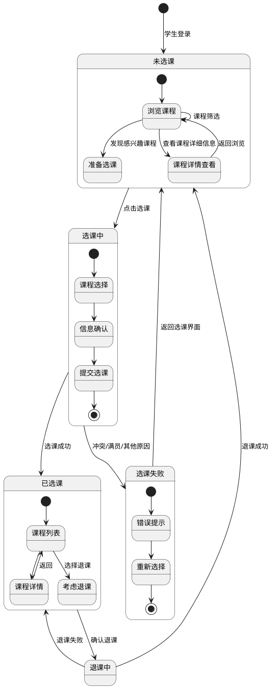
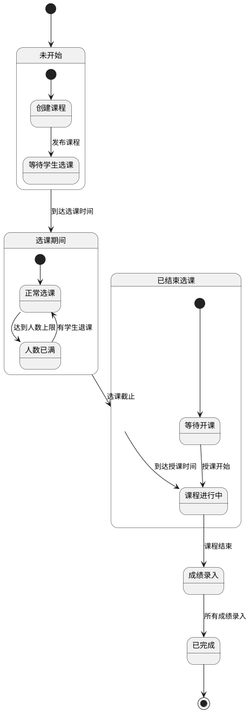

# 学生选课管理系统 - 状态图

## 选课过程状态图

## 课程状态图

## 状态图说明

### 学生选课状态图

该状态图描述了学生从登录到完成选课或退课的整个过程:

1. **未选课状态**:
   - 学生登录后处于未选课状态
   - 可以浏览课程，查看课程详情
   - 发现感兴趣的课程后可以进入选课流程

2. **选课中状态**:
   - 学生选择课程并确认信息
   - 提交选课请求

3. **选课结果**:
   - 若选课成功，进入已选课状态
   - 若选课失败（如课程冲突、人数已满），进入选课失败状态

4. **已选课状态**:
   - 可以查看已选课程列表和详情
   - 可以考虑退课

5. **退课流程**:
   - 从已选课状态确认退课，进入退课中状态
   - 退课成功则回到未选课状态，失败则保持已选课状态

### 课程状态图

该状态图描述了课程从创建到完成的整个生命周期:

1. **未开始状态**:
   - 教师创建课程
   - 课程等待学生选课

2. **选课期间状态**:
   - 学生可以选课
   - 可能达到人数上限
   - 当有学生退课时可以重新开放选课

3. **已结束选课状态**:
   - 选课截止后，课程等待开始授课

4. **课程进行中状态**:
   - 老师开始授课
   - 学生参与学习

5. **成绩录入状态**:
   - 课程结束后，教师录入学生成绩

6. **已完成状态**:
   - 所有流程结束，课程存档 