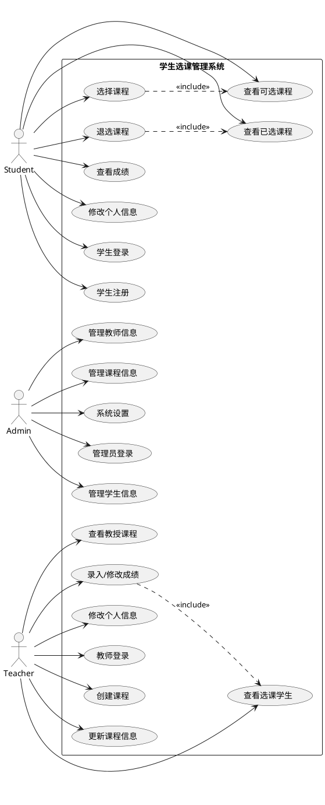

# 学生选课管理系统 - 用例图

## 用例描述

### 学生用例

#### 1. 学生登录
- **主要参与者**：学生
- **前置条件**：学生已注册账号
- **后置条件**：学生成功登录系统
- **主要流程**：
  1. 学生访问系统登录页面
  2. 输入学号和密码
  3. 系统验证信息
  4. 验证成功，跳转至学生主页
- **替代流程**：
  - 验证失败，显示错误信息

#### 2. 学生注册
- **主要参与者**：学生
- **前置条件**：无
- **后置条件**：创建新的学生账号
- **主要流程**：
  1. 学生访问注册页面
  2. 填写个人信息（学号、姓名、密码等）
  3. 系统验证信息
  4. 创建账号
- **替代流程**：
  - 学号已存在，提示重新输入

#### 3. 查看可选课程
- **主要参与者**：学生
- **前置条件**：学生已登录
- **后置条件**：显示可选课程列表
- **主要流程**：
  1. 学生进入选课页面
  2. 系统显示所有可选课程
  3. 学生可以查看课程详情

#### 4. 选择课程
- **主要参与者**：学生
- **前置条件**：学生已登录
- **后置条件**：学生成功选课
- **主要流程**：
  1. 学生查看可选课程
  2. 选择想要的课程
  3. 确认选课
  4. 系统记录选课信息
- **替代流程**：
  - 课程已满员，提示选课失败
  - 课程冲突，提示选课失败

#### 5. 退选课程
- **主要参与者**：学生
- **前置条件**：学生已登录且已选过课程
- **后置条件**：成功退选课程
- **主要流程**：
  1. 学生查看已选课程
  2. 选择要退的课程
  3. 确认退课
  4. 系统删除选课记录
- **替代流程**：
  - 退课时间已过，提示不能退课

### 教师用例

#### 1. 教师登录
- **主要参与者**：教师
- **前置条件**：教师账号已存在
- **后置条件**：教师成功登录系统
- **主要流程**：
  1. 教师访问系统登录页面
  2. 输入工号和密码
  3. 系统验证信息
  4. 验证成功，跳转至教师主页
- **替代流程**：
  - 验证失败，显示错误信息

#### 2. 创建课程
- **主要参与者**：教师
- **前置条件**：教师已登录
- **后置条件**：成功创建新课程
- **主要流程**：
  1. 教师进入创建课程页面
  2. 填写课程信息（课程号、名称、学分等）
  3. 提交课程信息
  4. 系统创建新课程
- **替代流程**：
  - 课程号已存在，提示重新输入

### 管理员用例

#### 1. 管理员登录
- **主要参与者**：管理员
- **前置条件**：管理员账号已存在
- **后置条件**：管理员成功登录系统
- **主要流程**：
  1. 管理员访问系统登录页面
  2. 输入管理员ID和密码
  3. 系统验证信息
  4. 验证成功，跳转至管理员主页
- **替代流程**：
  - 验证失败，显示错误信息

#### 2. 管理学生信息
- **主要参与者**：管理员
- **前置条件**：管理员已登录
- **后置条件**：学生信息被修改
- **主要流程**：
  1. 管理员进入学生管理页面
  2. 查看学生列表
  3. 选择要管理的学生
  4. 修改信息或执行其他操作
  5. 保存修改
- **替代流程**：
  - 输入数据无效，提示重新输入 