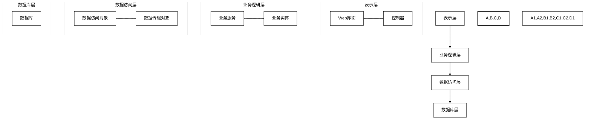
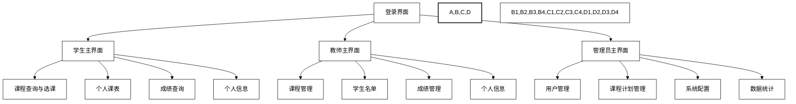
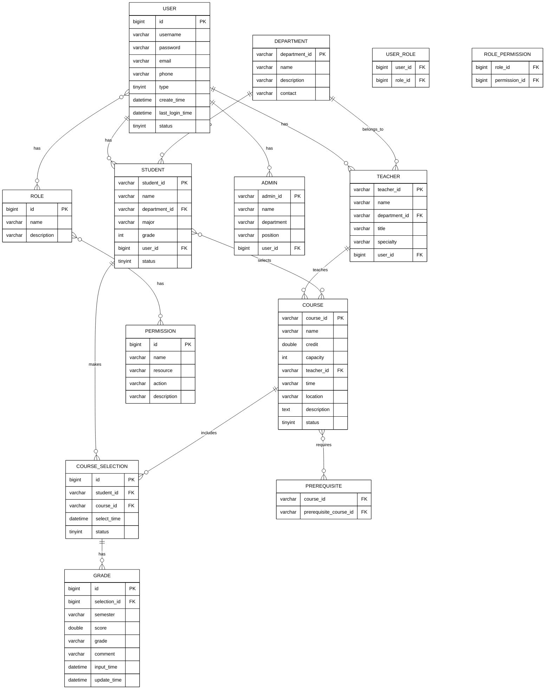

# 学生选课管理系统-设计规格说明书

## 1 概要设计
本章主要介绍学生选课管理系统的概要设计，包括系统功能结构、包设计和界面设计。

### 1.1 系统功能结构

系统总体功能结构采用分层架构设计，分为表示层、业务逻辑层、数据访问层和数据库层。各层级的功能职责如下：

- **表示层**：负责用户交互，包括Web界面和相关控制逻辑
- **业务逻辑层**：处理核心业务流程，实现业务规则
- **数据访问层**：处理数据的存取操作，连接业务逻辑层和数据库
- **数据库层**：存储系统数据

系统功能结构图如下：

```mermaid
%%{init: {'theme': 'base', 'themeVariables': { 'primaryColor': '#ffffff', 'primaryTextColor': '#000000', 'primaryBorderColor': '#000000', 'lineColor': '#000000', 'secondaryColor': '#ffffff', 'tertiaryColor': '#ffffff' }}}%%
graph TD
    A[学生选课管理系统] --> B[选课管理模块]
    A --> C[课程管理模块]
    A --> D[成绩管理模块]
    A --> E[系统管理模块]
    
    B --> B1[课程查询]
    B --> B2[选课申请处理]
    B --> B3[退课处理]
    B --> B4[个人课表生成]
    B --> B5[选课冲突检测]
    
    C --> C1[课程信息维护]
    C --> C2[教学任务分配]
    C --> C3[教学班管理]
    C --> C4[课程计划维护]
    C --> C5[选课名单生成]
    
    D --> D1[成绩录入]
    D --> D2[成绩修改审核]
    D --> D3[成绩查询]
    D --> D4[成绩统计分析]
    D --> D5[成绩单生成]
    
    E --> E1[用户管理]
    E --> E2[权限控制]
    E --> E3[数据备份恢复]
    E --> E4[系统参数配置]
    E --> E5[日志管理]
    
    style A fill:#ffffff,stroke:#000000,stroke-width:2px
    style B,C,D,E fill:#ffffff,stroke:#000000,stroke-width:2px
    style B1,B2,B3,B4,B5,C1,C2,C3,C4,C5,D1,D2,D3,D4,D5,E1,E2,E3,E4,E5 fill:#ffffff,stroke:#000000,stroke-width:1px
```



系统分层结构图如下：



### 1.2 包设计

系统的包结构设计反映了系统的分层架构，同时体现了系统的功能模块划分。包的组织结构如下：

```mermaid
%%{init: {'theme': 'base', 'themeVariables': { 'primaryColor': '#ffffff', 'primaryTextColor': '#000000', 'primaryBorderColor': '#000000', 'lineColor': '#000000', 'secondaryColor': '#ffffff', 'tertiaryColor': '#ffffff' }}}%%
classDiagram
    com.coursesystem --> com.coursesystem.controller
    com.coursesystem --> com.coursesystem.service
    com.coursesystem --> com.coursesystem.dao
    com.coursesystem --> com.coursesystem.entity
    com.coursesystem --> com.coursesystem.util
    
    com.coursesystem.controller --> com.coursesystem.controller.student
    com.coursesystem.controller --> com.coursesystem.controller.teacher
    com.coursesystem.controller --> com.coursesystem.controller.admin
    
    com.coursesystem.service --> com.coursesystem.service.impl
    com.coursesystem.service --> com.coursesystem.service.course
    com.coursesystem.service --> com.coursesystem.service.selection
    com.coursesystem.service --> com.coursesystem.service.grade
    com.coursesystem.service --> com.coursesystem.service.system
    
    com.coursesystem.dao --> com.coursesystem.dao.impl
    
    com.coursesystem.entity --> com.coursesystem.entity.dto
    com.coursesystem.entity --> com.coursesystem.entity.vo
    
    com.coursesystem.util --> com.coursesystem.util.security
    com.coursesystem.util --> com.coursesystem.util.export
    
    class "com.coursesystem.controller" {
        控制器包
    }
    class "com.coursesystem.service" {
        业务服务包
    }
    class "com.coursesystem.dao" {
        数据访问包
    }
    class "com.coursesystem.entity" {
        实体类包
    }
    class "com.coursesystem.util" {
        工具类包
    }
    
    style com.coursesystem fill:#ffffff,stroke:#000000
```

主要包说明：

1. **com.coursesystem.controller**: 包含所有控制器类，负责处理用户请求和返回响应
   - student: 学生相关控制器
   - teacher: 教师相关控制器
   - admin: 管理员相关控制器

2. **com.coursesystem.service**: 包含所有业务服务接口和实现
   - impl: 业务服务实现类
   - course: 课程相关服务
   - selection: 选课相关服务
   - grade: 成绩相关服务
   - system: 系统管理相关服务

3. **com.coursesystem.dao**: 包含所有数据访问对象
   - impl: 数据访问对象实现类

4. **com.coursesystem.entity**: 包含所有实体类
   - dto: 数据传输对象
   - vo: 视图对象

5. **com.coursesystem.util**: 包含各种工具类
   - security: 安全相关工具类
   - export: 数据导出工具类

### 1.3 界面设计

系统界面采用响应式Web设计，主要界面规划如下：

#### 1.3.1 界面原型与导航结构



#### 1.3.2 主要界面设计

1. **登录界面**：
   - 用户名/密码输入框
   - 登录按钮
   - 角色选择（学生/教师/管理员）
   - 忘记密码链接

2. **学生选课界面**：
   - 课程搜索区域（按名称、教师、时间等）
   - 课程列表展示区
   - 已选课程展示区
   - 选课/退课操作按钮
   - 课程详情查看功能

3. **教师成绩管理界面**：
   - 课程选择下拉框
   - 学生名单表格
   - 成绩输入区域
   - 批量导入/导出按钮
   - 提交/保存按钮

4. **管理员系统配置界面**：
   - 参数配置选项卡
   - 用户管理选项卡
   - 权限配置选项卡
   - 系统日志选项卡

## 2 详细设计

### 2.1 类设计

#### 2.1.1 实体类设计

```mermaid
%%{init: {'theme': 'base', 'themeVariables': { 'primaryColor': '#ffffff', 'primaryTextColor': '#000000', 'primaryBorderColor': '#000000', 'lineColor': '#000000', 'secondaryColor': '#ffffff', 'tertiaryColor': '#ffffff' }}}%%
classDiagram
    Student "1" -- "*" CourseSelection
    Course "1" -- "*" CourseSelection
    Teacher "1" -- "*" Course
    CourseSelection "1" -- "0..1" Grade
    Department "1" -- "*" Student
    Department "1" -- "*" Teacher
    Department "1" -- "*" Course
    User <|-- Student
    User <|-- Teacher
    User <|-- Admin
    Role "1" -- "*" User
    Permission "1" -- "*" Role
    
    class User {
        -Long id
        -String username
        -String password
        -String email
        -String phone
        -Date createTime
        -Date lastLoginTime
        -Integer status
        +login()
        +logout()
        +updatePassword()
    }
    
    class Student {
        -String studentId
        -String name
        -Department department
        -String major
        -Integer grade
        -Integer status
        +selectCourse()
        +dropCourse()
        +viewSchedule()
        +queryGrade()
    }
    
    class Teacher {
        -String teacherId
        -String name
        -Department department
        -String title
        -String specialty
        +manageCourse()
        +inputGrade()
        +viewClassList()
    }
    
    class Admin {
        -String adminId
        -String name
        -String department
        -String position
        +manageUser()
        +configureSys()
        +backupData()
    }
    
    class Role {
        -Long id
        -String name
        -String description
        +getPermissions()
    }
    
    class Permission {
        -Long id
        -String name
        -String resource
        -String action
        -String description
    }
    
    class Course {
        -String courseId
        -String name
        -Double credit
        -Integer capacity
        -Teacher teacher
        -String time
        -String location
        -String description
        -Integer status
        +getAvailableCapacity()
        +getStudentList()
        +updateInfo()
    }
    
    class CourseSelection {
        -Long id
        -Student student
        -Course course
        -Date selectTime
        -Integer status
        +save()
        +cancel()
        +update()
    }
    
    class Department {
        -String departmentId
        -String name
        -String description
        -String contact
        +manageCurriculum()
        +assignTeachingTask()
    }
    
    class Grade {
        -Long id
        -CourseSelection courseSelection
        -String semester
        -Double score
        -String grade
        -String comment
        -Date inputTime
        -Date updateTime
        +calculate()
        +update()
    }
    
    style User,Student,Teacher,Admin,Role,Permission,Course,CourseSelection,Department,Grade fill:#ffffff,stroke:#000000
```

#### 2.1.2 主要业务类设计

**CourseService接口**:

```java
public interface CourseService {
    // 获取所有课程
    List<CourseVO> getAllCourses();
    
    // 根据条件查询课程
    List<CourseVO> queryCourses(CourseQueryDTO queryDTO);
    
    // 获取课程详情
    CourseDetailVO getCourseDetail(String courseId);
    
    // 添加课程
    boolean addCourse(CourseDTO courseDTO);
    
    // 更新课程信息
    boolean updateCourse(CourseDTO courseDTO);
    
    // 删除课程
    boolean deleteCourse(String courseId);
    
    // 获取课程剩余容量
    int getAvailableCapacity(String courseId);
    
    // 获取选课学生名单
    List<StudentVO> getCourseStudents(String courseId);
}
```

**SelectionService接口**:

```java
public interface SelectionService {
    // 学生选课
    SelectionResultVO selectCourse(String studentId, String courseId);
    
    // 学生退课
    boolean dropCourse(String studentId, String courseId);
    
    // 检查选课冲突
    List<CourseConflictVO> checkConflict(String studentId, String courseId);
    
    // 检查先修课程要求
    boolean checkPrerequisite(String studentId, String courseId);
    
    // 获取学生已选课程
    List<CourseVO> getStudentCourses(String studentId);
    
    // 生成学生课表
    ScheduleVO generateSchedule(String studentId);
}
```

**GradeService接口**:

```java
public interface GradeService {
    // 保存成绩
    boolean saveGrade(GradeDTO gradeDTO);
    
    // 批量保存成绩
    boolean batchSaveGrade(List<GradeDTO> gradeDTOs);
    
    // 申请修改成绩
    boolean applyModifyGrade(GradeModifyDTO modifyDTO);
    
    // 审核修改成绩申请
    boolean approveGradeModification(Long modifyId, boolean approved);
    
    // 查询学生成绩
    List<GradeVO> queryStudentGrades(String studentId, String semester);
    
    // 统计课程成绩
    CourseGradeStatVO calculateCourseGradeStat(String courseId);
    
    // 生成成绩单
    TranscriptVO generateTranscript(String studentId);
}
```

### 2.2 系统功能模块设计

#### 2.2.1 选课管理模块设计

选课管理模块负责处理学生的选课相关功能，包括课程查询、选课申请处理、退课处理等。

**选课流程设计**:

```mermaid
%%{init: {'theme': 'base', 'themeVariables': { 'primaryColor': '#ffffff', 'primaryTextColor': '#000000', 'primaryBorderColor': '#000000', 'lineColor': '#000000', 'secondaryColor': '#ffffff', 'tertiaryColor': '#ffffff' }}}%%
sequenceDiagram
    participant Student
    participant CourseController
    participant SelectionService
    participant CourseService
    participant CourseSelectionDAO
    participant CourseDAO
    
    Student->>CourseController: 查询课程
    CourseController->>CourseService: queryCourses(queryDTO)
    CourseService->>CourseDAO: findByConditions(queryDTO)
    CourseDAO-->>CourseService: 课程列表
    CourseService-->>CourseController: 课程列表
    CourseController-->>Student: 显示课程列表
    
    Student->>CourseController: 选择课程
    CourseController->>SelectionService: selectCourse(studentId, courseId)
    SelectionService->>CourseService: getAvailableCapacity(courseId)
    CourseService-->>SelectionService: 剩余容量
    SelectionService->>SelectionService: checkConflict(studentId, courseId)
    SelectionService->>SelectionService: checkPrerequisite(studentId, courseId)
    SelectionService->>CourseSelectionDAO: save(courseSelection)
    CourseSelectionDAO-->>SelectionService: 保存结果
    SelectionService->>CourseDAO: updateCapacity(courseId)
    CourseDAO-->>SelectionService: 更新结果
    SelectionService-->>CourseController: 选课结果
    CourseController-->>Student: 显示选课结果
    
    style Student fill:#ffffff,stroke:#000000
    style CourseController fill:#ffffff,stroke:#000000
    style SelectionService fill:#ffffff,stroke:#000000
    style CourseService fill:#ffffff,stroke:#000000
    style CourseSelectionDAO fill:#ffffff,stroke:#000000
    style CourseDAO fill:#ffffff,stroke:#000000
```

#### 2.2.2 成绩管理模块设计

成绩管理模块负责处理教师录入成绩、学生查询成绩等功能。

**成绩录入流程设计**:

```mermaid
%%{init: {'theme': 'base', 'themeVariables': { 'primaryColor': '#ffffff', 'primaryTextColor': '#000000', 'primaryBorderColor': '#000000', 'lineColor': '#000000', 'secondaryColor': '#ffffff', 'tertiaryColor': '#ffffff' }}}%%
sequenceDiagram
    participant Teacher
    participant GradeController
    participant GradeService
    participant CourseService
    participant GradeDAO
    
    Teacher->>GradeController: 选择课程
    GradeController->>CourseService: getCourseStudents(courseId)
    CourseService-->>GradeController: 学生名单
    GradeController-->>Teacher: 显示学生名单
    
    Teacher->>GradeController: 输入成绩
    GradeController->>GradeService: batchSaveGrade(gradeDTOs)
    GradeService->>GradeService: 验证成绩数据
    GradeService->>GradeService: 计算最终成绩
    GradeService->>GradeDAO: batchInsert(grades)
    GradeDAO-->>GradeService: 保存结果
    GradeService-->>GradeController: 保存结果
    GradeController-->>Teacher: 显示保存结果
    
    style Teacher fill:#ffffff,stroke:#000000
    style GradeController fill:#ffffff,stroke:#000000
    style GradeService fill:#ffffff,stroke:#000000
    style CourseService fill:#ffffff,stroke:#000000
    style GradeDAO fill:#ffffff,stroke:#000000
```

## 3 数据库设计

### 3.1 数据库概要设计

#### 3.1.1 数据库ER图



#### 3.1.2 数据库表关系

系统数据库设计包含以下主要表：

1. **USER**：存储所有用户的基本信息
2. **STUDENT**：存储学生特有信息
3. **TEACHER**：存储教师特有信息
4. **ADMIN**：存储管理员特有信息
5. **COURSE**：存储课程信息
6. **COURSE_SELECTION**：存储选课信息
7. **GRADE**：存储成绩信息
8. **DEPARTMENT**：存储院系信息
9. **ROLE**：存储角色信息
10. **PERMISSION**：存储权限信息
11. **USER_ROLE**：用户角色关联表
12. **ROLE_PERMISSION**：角色权限关联表
13. **PREREQUISITE**：课程先修关系表

### 3.2 数据库详细设计

#### 3.2.1 USER表

| 字段名 | 数据类型 | 长度 | 允许NULL | 主键 | 说明 |
|-------|---------|------|---------|-----|------|
| id | BIGINT | - | 否 | 是 | 用户ID，自增 |
| username | VARCHAR | 50 | 否 | 否 | 用户名 |
| password | VARCHAR | 100 | 否 | 否 | 密码(加密存储) |
| email | VARCHAR | 100 | 是 | 否 | 电子邮箱 |
| phone | VARCHAR | 20 | 是 | 否 | 电话号码 |
| type | TINYINT | - | 否 | 否 | 用户类型(1学生,2教师,3管理员) |
| create_time | DATETIME | - | 否 | 否 | 创建时间 |
| last_login_time | DATETIME | - | 是 | 否 | 最后登录时间 |
| status | TINYINT | - | 否 | 否 | 状态(0禁用,1启用) |

#### 3.2.2 STUDENT表

| 字段名 | 数据类型 | 长度 | 允许NULL | 主键 | 说明 |
|-------|---------|------|---------|-----|------|
| student_id | VARCHAR | 20 | 否 | 是 | 学号 |
| name | VARCHAR | 50 | 否 | 否 | 姓名 |
| department_id | VARCHAR | 20 | 否 | 否 | 院系ID，外键 |
| major | VARCHAR | 50 | 否 | 否 | 专业 |
| grade | INT | - | 否 | 否 | 年级 |
| user_id | BIGINT | - | 否 | 否 | 用户ID，外键 |
| status | TINYINT | - | 否 | 否 | 状态(0休学,1在读) |

#### 3.2.3 COURSE表

| 字段名 | 数据类型 | 长度 | 允许NULL | 主键 | 说明 |
|-------|---------|------|---------|-----|------|
| course_id | VARCHAR | 20 | 否 | 是 | 课程编号 |
| name | VARCHAR | 100 | 否 | 否 | 课程名称 |
| credit | DOUBLE | - | 否 | 否 | 学分 |
| capacity | INT | - | 否 | 否 | 容量 |
| teacher_id | VARCHAR | 20 | 否 | 否 | 教师ID，外键 |
| time | VARCHAR | 100 | 否 | 否 | 上课时间 |
| location | VARCHAR | 100 | 否 | 否 | 上课地点 |
| description | TEXT | - | 是 | 否 | 课程描述 |
| status | TINYINT | - | 否 | 否 | 状态(0未开课,1已开课) |

#### 3.2.4 COURSE_SELECTION表

| 字段名 | 数据类型 | 长度 | 允许NULL | 主键 | 说明 |
|-------|---------|------|---------|-----|------|
| id | BIGINT | - | 否 | 是 | 选课ID，自增 |
| student_id | VARCHAR | 20 | 否 | 否 | 学生ID，外键 |
| course_id | VARCHAR | 20 | 否 | 否 | 课程ID，外键 |
| select_time | DATETIME | - | 否 | 否 | 选课时间 |
| status | TINYINT | - | 否 | 否 | 状态(0已退课,1有效) |

#### 3.2.5 GRADE表

| 字段名 | 数据类型 | 长度 | 允许NULL | 主键 | 说明 |
|-------|---------|------|---------|-----|------|
| id | BIGINT | - | 否 | 是 | 成绩ID，自增 |
| selection_id | BIGINT | - | 否 | 否 | 选课ID，外键 |
| semester | VARCHAR | 20 | 否 | 否 | 学期 |
| score | DOUBLE | - | 是 | 否 | 分数 |
| grade | VARCHAR | 5 | 是 | 否 | 等级(A,B,C,D,F) |
| comment | VARCHAR | 200 | 是 | 否 | 评语 |
| input_time | DATETIME | - | 否 | 否 | 录入时间 |
| update_time | DATETIME | - | 是 | 否 | 更新时间 | 