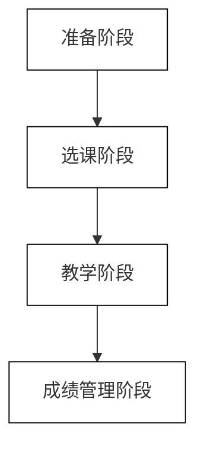
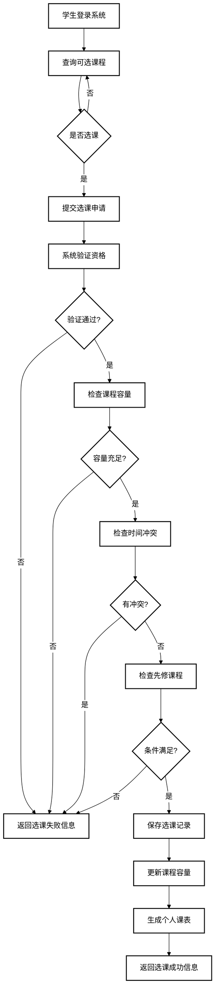

# 学生选课管理系统需求规格说明书

## 1. 引言

### 1.1 编写目的

本需求规格说明书旨在详细描述学生选课管理系统的功能需求和非功能需求，为系统开发提供准确详尽的依据。本文档的主要读者包括：
- 项目开发团队：作为系统设计和实现的基础
- 测试团队：作为测试用例设计和系统验收的依据
- 用户代表：了解系统将提供的功能和服务
- 项目管理人员：作为项目规划和进度控制的依据

### 1.2 项目背景

随着高校教育信息化建设的不断推进，传统的手工选课方式已不能满足现代教学管理的需求。学生选课管理系统是高校教务管理的核心组成部分，对提高教学管理效率、优化教学资源配置具有重要意义。

本项目旨在开发一套完整的学生选课管理系统，实现学生选课、教师课程管理、管理员系统维护等功能，以满足高校教学管理的实际需求，提高教学管理效率。

### 1.3 定义

| 术语 | 定义 |
|------|------|
| 选课 | 学生根据培养方案和个人需求，在规定时间内选择修读的课程 |
| 退课 | 学生在规定时间内取消已选课程 |
| 课表 | 显示学生已选课程的时间和地点的表格 |
| 教学班 | 针对某一课程组织的教学单位 |
| 先修课程 | 学习某课程前必须先修读的前导课程 |
| 学分 | 课程学习量的计量单位 |
| 绩点 | 用于评价学生学习质量的指标 |

### 1.4 参考资料

1. 《高等学校教学管理规范》
2. 《教育部关于全面提高高等教育质量的若干意见》
3. 《数据流图设计规范》
4. 《软件需求规格说明标准 GB/T 9385-2008》
5. 《面向对象的分析与设计》

## 2. 任务概述

### 2.1 目标

学生选课管理系统的主要目标是：

1. **自动化选课流程**：为学生提供便捷的网络选课平台，减少人工干预和纸质处理。
2. **优化教学资源分配**：根据选课情况合理分配教室、教师等教学资源。
3. **提高管理效率**：为教师和管理员提供便捷的课程管理和系统维护功能。
4. **数据分析支持**：通过数据统计分析，为教学决策提供支持。
5. **数据安全保障**：确保学生、教师及课程信息的安全存储和访问。

### 2.2 运行环境

#### 2.2.1 硬件环境

- **服务器环境**：
  - CPU: Intel Xeon E5 或同等性能处理器
  - 内存: 16GB 以上
  - 硬盘: 1TB 以上
  - 网络: 千兆网络接口

- **客户端环境**：
  - 支持标准浏览器的计算机或移动设备
  - 网络连接（校园网或互联网）

#### 2.2.2 软件环境

- **服务器端**：
  - 操作系统: Windows Server 2016/Linux CentOS 7 或更高版本
  - 数据库: MySQL 8.0 或更高版本
  - Web服务器: Apache/Nginx
  - 后端框架: Spring Boot

- **客户端**：
  - 浏览器: Chrome, Firefox, Edge, Safari 等现代浏览器
  - 操作系统: 支持现代浏览器的任何操作系统

### 2.3 条件与限制

1. **时间限制**：系统必须在指定学期开始前完成开发和测试。
2. **安全性要求**：系统必须符合国家教育信息安全相关规定。
3. **并发性要求**：系统应能支持学校内全体师生的同时使用，特别是在选课高峰期。
4. **兼容性要求**：系统应能与学校现有的教务系统进行数据交换。
5. **性能要求**：系统在高负载下仍能保持良好的响应速度。
6. **可靠性要求**：系统应具备数据备份和恢复机制，确保数据的安全性。

## 3. 用户需求

### 3.1 总体功能

#### 3.1.1 总体业务流程

学生选课管理系统的总体业务流程主要包括以下几个阶段：

1. **准备阶段**：
   - 管理员配置系统参数，包括学期信息、选课时间等
   - 教师提交开课申请，录入课程信息
   - 教务部门审核课程信息，确定开课计划

2. **选课阶段**：
   - 学生登录系统，查询可选课程
   - 学生进行选课操作，系统进行资格验证、冲突检测等
   - 学生可以查看和调整个人课表
   - 教师可以查看选课学生名单

3. **教学阶段**：
   - 学生按照课表参加课程学习
   - 教师进行教学活动，可查看班级学生名单
   - 管理员处理选课过程中的特殊情况

4. **成绩管理阶段**：
   - 教师录入学生成绩
   - 学生查询个人成绩
   - 管理员和教务部门进行成绩统计分析

#### 3.1.2 总体功能划分

学生选课管理系统的功能根据不同用户角色和业务需求，可划分为以下几个主要模块：

1. **选课管理模块**：
   - 课程查询功能
   - 选课申请处理
   - 退课处理
   - 个人课表生成
   - 选课冲突检测

2. **课程管理模块**：
   - 课程信息维护
   - 教学任务分配
   - 教学班管理
   - 课程计划维护
   - 选课名单生成

3. **成绩管理模块**：
   - 成绩录入
   - 成绩修改审核
   - 成绩查询
   - 成绩统计分析
   - 成绩单生成

4. **系统管理模块**：
   - 用户管理
   - 权限控制
   - 数据备份恢复
   - 系统参数配置
   - 日志管理

5. **数据统计与分析模块**：
   - 选课情况统计
   - 成绩分布分析
   - 教学资源利用分析
   - 报表生成

### 3.2 选课管理

#### 3.2.1 业务流程

选课管理的业务流程主要包括学生查询课程、提交选课申请、系统处理选课请求、生成个人课表等环节。

#### 3.2.2 功能描述

**1. 课程查询功能**

- 功能说明：允许学生查询当前学期可选课程信息
- 操作流程：学生登录 → 进入课程查询页面 → 设置查询条件 → 查看课程列表
- 功能要点：
  - 支持按课程名称、教师、开课时间等多条件查询
  - 显示课程详细信息（学分、课时、上课时间地点等）
  - 支持分页显示查询结果

**2. 选课申请处理**

- 功能说明：处理学生提交的选课申请
- 操作流程：学生选择课程 → 提交选课申请 → 系统验证 → 返回选课结果
- 功能要点：
  - 检查学生选课资格（是否在选课时间内、是否达到选课学分上限等）
  - 检查课程容量是否充足
  - 检查时间冲突
  - 检查先修课程要求
  - 保存选课记录

**3. 退课处理**

- 功能说明：处理学生的退课申请
- 操作流程：学生查看已选课程 → 选择需退课程 → 提交退课申请 → 系统处理 → 返回退课结果
- 功能要点：
  - 检查是否在退课期限内
  - 更新选课记录状态
  - 恢复课程容量

**4. 个人课表生成**

- 功能说明：根据学生选课结果生成个人课表
- 操作流程：学生进入课表页面 → 系统读取选课数据 → 生成并显示课表
- 功能要点：
  - 以周为单位显示课表
  - 显示课程名称、上课时间、地点、教师等信息
  - 支持课表导出（PDF、Excel等格式） 