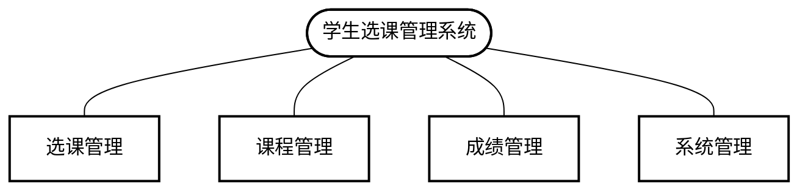

### 3.3 课程管理

#### 3.3.1 业务流程

课程管理的业务流程主要包括教师维护课程信息、教务部门制定教学计划、分配教学任务、管理教学班等环节。

#### 3.3.2 功能描述

**1. 课程信息维护**

- 功能说明：允许教师维护课程基本信息
- 操作流程：教师登录 → 进入课程管理页面 → 选择/新增课程 → 编辑课程信息 → 保存
- 功能要点：
  - 维护课程基本信息（名称、编号、学分、学时等）
  - 设置课程教学大纲
  - 上传课程相关资料
  - 设置课程容量和先修课程要求

**2. 教学任务分配**

- 功能说明：教务部门为课程分配教师
- 操作流程：管理员登录 → 进入教学任务管理页面 → 选择课程 → 分配教师 → 保存
- 功能要点：
  - 查看教师教学任务情况
  - 根据教师专业和工作量分配教学任务
  - 生成教学任务书
  - 通知相关教师

**3. 教学班管理**

- 功能说明：管理课程教学班
- 操作流程：教师/管理员登录 → 进入教学班管理页面 → 设置教学班信息 → 保存
- 功能要点：
  - 设置教学班容量
  - 安排上课时间和地点
  - 管理教学班学生名单
  - 调整教学班安排

**4. 课程计划维护**

- 功能说明：维护专业培养方案和课程计划
- 操作流程：教务管理员登录 → 进入课程计划页面 → 选择专业 → 编辑课程计划 → 保存
- 功能要点：
  - 设置专业必修/选修课程
  - 规定课程修读学期
  - 设置学分要求
  - 发布课程计划

### 3.4 成绩管理

#### 3.4.1 业务流程

成绩管理的业务流程主要包括教师录入成绩、学生查询成绩、教务部门审核和统计成绩等环节。

#### 3.4.2 功能描述

**1. 成绩录入**

- 功能说明：允许教师录入学生成绩
- 操作流程：教师登录 → 进入成绩管理页面 → 选择课程 → 录入成绩 → 提交
- 功能要点：
  - 支持批量导入成绩（Excel导入）
  - 验证成绩数据有效性
  - 按照评分规则计算最终成绩
  - 支持成绩补录和修改

**2. 成绩修改审核**

- 功能说明：处理成绩修改申请
- 操作流程：教师提交修改申请 → 管理员审核 → 系统更新成绩
- 功能要点：
  - 记录修改原因和历史记录
  - 审核流程控制
  - 通知相关学生成绩变更

**3. 成绩查询**

- 功能说明：允许学生查询个人成绩
- 操作流程：学生登录 → 进入成绩查询页面 → 选择学期 → 查看成绩
- 功能要点：
  - 显示课程成绩详情
  - 计算学期平均绩点
  - 显示历史学期成绩
  - 支持成绩趋势分析

**4. 成绩统计分析**

- 功能说明：对课程成绩进行统计和分析
- 操作流程：教师/管理员登录 → 进入成绩分析页面 → 选择分析维度 → 查看分析结果
- 功能要点：
  - 生成成绩分布图表
  - 计算平均分、最高分、最低分等统计值
  - 与历史数据对比分析
  - 生成分析报告

## 4. 功能需求

### 4.1 系统角色分析

学生选课管理系统涉及以下主要角色：

1. **学生**
   - 权限：选课、退课、查询课程、查看课表、查询成绩
   - 职责：在规定时间内完成选课，遵守选课规则

2. **教师**
   - 权限：维护课程信息、查看选课名单、录入成绩、查看成绩统计
   - 职责：提供准确的课程信息，及时录入学生成绩

3. **管理员**
   - 权限：管理用户账号、分配权限、配置系统参数、维护基础数据
   - 职责：确保系统正常运行，处理异常情况

4. **教务管理人员**
   - 权限：制定课程计划、分配教学任务、审核开课申请、查看统计报表
   - 职责：合理安排教学资源，监控教学质量

### 4.2 系统用例分析

#### 4.2.1 学生选课管理系统用例

#### 4.2.2 选课管理用例

| 用例名称 | 课程查询 |
|---------|---------|
| 参与者   | 学生    |
| 前置条件 | 学生已登录系统 |
| 基本流程 | 1. 学生进入课程查询页面 2. 系统显示查询条件 3. 学生输入查询条件 4. 系统根据条件查询课程信息 5. 系统返回符合条件的课程列表 |
| 异常流程 | 4a. 系统找不到符合条件的课程    1. 系统提示无符合条件的课程    2. 返回步骤2 |
| 后置条件 | 学生获取符合条件的课程信息 |

| 用例名称 | 选课申请 |
|---------|---------|
| 参与者   | 学生    |
| 前置条件 | 学生已登录系统且在选课时间内 |
| 基本流程 | 1. 学生从课程列表中选择课程 2. 学生提交选课申请 3. 系统验证学生选课资格 4. 系统检查课程容量 5. 系统检查时间冲突 6. 系统检查先修课程 7. 系统保存选课记录 8. 系统返回选课成功信息 |
| 异常流程 | 3a. 学生不具备选课资格    1. 系统提示资格不符    2. 终止用例 4a. 课程容量不足    1. 系统提示课程已满    2. 终止用例 5a. 存在时间冲突    1. 系统提示时间冲突    2. 终止用例 6a. 先修课程要求不满足    1. 系统提示缺少先修课程    2. 终止用例 |
| 后置条件 | 学生成功选择课程 |

#### 4.2.3 课程管理用例

| 用例名称 | 课程信息维护 |
|---------|---------|
| 参与者   | 教师    |
| 前置条件 | 教师已登录系统且具有课程维护权限 |
| 基本流程 | 1. 教师进入课程管理页面 2. 教师选择需维护的课程 3. 系统显示课程详细信息 4. 教师修改课程信息 5. 教师提交修改 6. 系统验证修改有效性 7. 系统保存课程信息 |
| 异常流程 | 6a. 修改信息不符合规范    1. 系统提示错误信息    2. 返回步骤4 |
| 后置条件 | 课程信息更新成功 |

#### 4.2.4 成绩管理用例

| 用例名称 | 成绩录入 |
|---------|---------|
| 参与者   | 教师    |
| 前置条件 | 教师已登录系统且在成绩录入时间内 |
| 基本流程 | 1. 教师进入成绩管理页面 2. 教师选择需录入成绩的课程 3. 系统显示选课学生名单 4. 教师录入学生成绩 5. 教师提交成绩 6. 系统验证成绩有效性 7. 系统保存成绩数据 |
| 异常流程 | 6a. 成绩数据不符合规范    1. 系统提示错误信息    2. 返回步骤4 |
| 后置条件 | 学生成绩录入成功 |

### 4.3 系统静态模型

#### 4.3.1 类图

学生选课管理系统的核心类及其关系如下：

### 4.4 系统动态模型

#### 4.4.1 选课活动图

#### 4.4.2 成绩管理状态图

## 5. 性能需求

### 5.1 可靠性需求

1. 系统正常运行时间（Uptime）应不低于99.9%，特别是在选课高峰期。
2. 系统应具备完善的数据备份和恢复机制，确保在发生故障时能迅速恢复。
3. 关键数据（如成绩信息）的存储应有多重保障措施，防止数据丢失。
4. 系统应能够抵御常见的安全威胁，如SQL注入、XSS攻击等。

### 5.2 时间特性

1. 系统响应时间：在正常负载下，页面加载时间不超过3秒。
2. 数据处理时间：批量选课处理不超过10秒，成绩导入不超过5秒/100条记录。
3. 高峰期性能：在选课高峰期，系统能同时处理1000个以上的选课请求，响应时间不超过5秒。
4. 数据库查询时间：复杂查询（如统计分析）不超过10秒，简单查询不超过1秒。

### 5.3 适应性

1. 系统应支持主流浏览器（Chrome, Firefox, Edge, Safari等），并对移动设备提供适配的界面。
2. 系统应能适应不同规模的院校使用，从小型学院到大型综合大学。
3. 系统应预留扩展接口，便于未来功能扩展和与其他系统集成。
4. 系统应能适应不同教学管理模式和选课规则，提供灵活的配置选项。

## 6. 运行需求

### 6.1 用户界面

1. 界面设计应简洁明了，符合现代交互设计标准。
2. 提供一致的导航和操作体验，减少用户学习成本。
3. 关键功能应有明确的提示和指引，降低操作错误率。
4. 支持自适应界面，适配不同屏幕尺寸的设备。

### 6.2 硬件接口

1. 系统应支持与学校现有硬件设备（如服务器、存储设备等）的连接。
2. 支持主流打印设备，用于打印课表、成绩单等。
3. 为移动设备提供适配的界面和功能。

### 6.3 软件接口

1. 提供标准的API接口，支持与其他教务系统（如学籍管理、教室管理等）数据交换。
2. 支持常见数据格式的导入导出（如Excel、CSV、PDF等）。
3. 支持与认证系统（如统一身份认证）的集成。

### 6.4 故障处理

1. 系统应有完善的错误日志记录机制，便于问题排查。
2. 对常见错误提供友好的提示和解决建议。
3. 关键操作（如选课、成绩录入）应有事务回滚机制，确保数据一致性。
4. 系统应能自动检测并报告异常情况，如服务中断、数据异常等。

## 7. 其它需求

1. **安全性需求**：
   - 实现基于角色的访问控制
   - 敏感数据（如密码、成绩）加密存储
   - 操作日志审计
   - 定期安全评估和漏洞修复

2. **可维护性需求**：
   - 模块化设计，便于维护和更新
   - 完善的技术文档
   - 代码注释规范
   - 定期功能优化和技术更新

3. **法规遵从性**：
   - 符合教育部相关数据管理规定
   - 遵守个人信息保护法规
   - 满足教学管理相关法规要求

4. **培训与支持**：
   - 提供用户操作手册
   - 为不同角色用户提供培训材料
   - 建立在线帮助系统
   - 提供技术支持和问题反馈渠道 