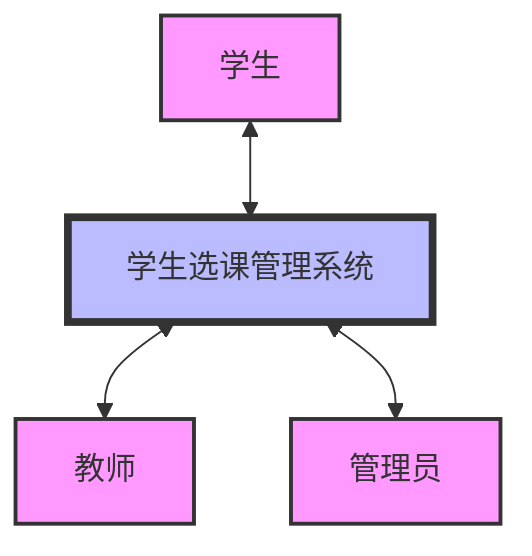
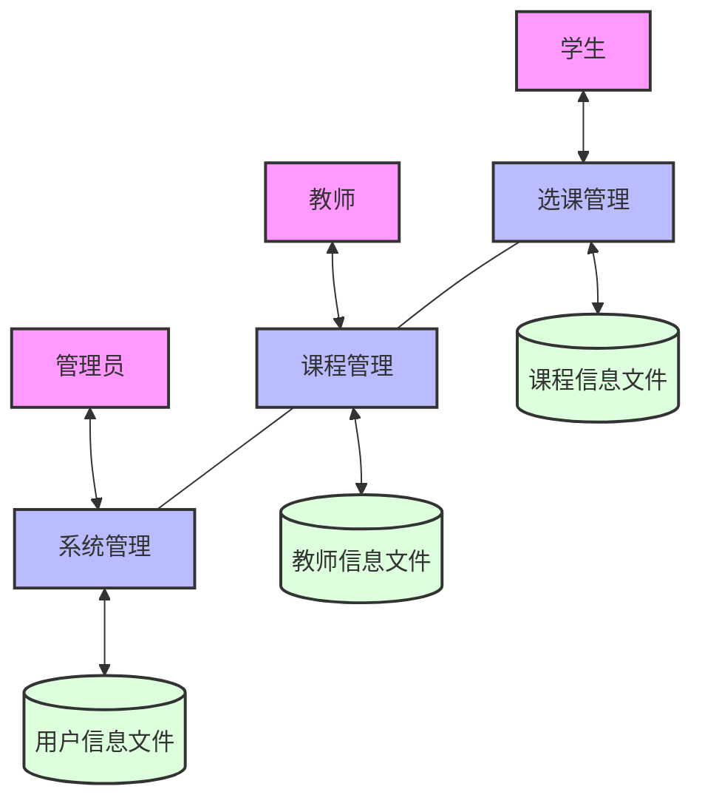
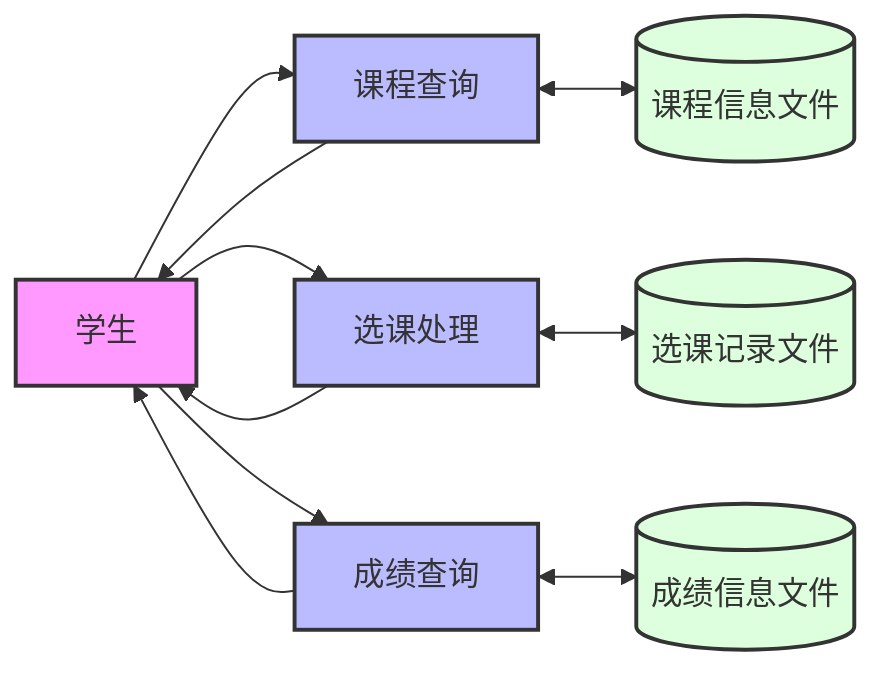
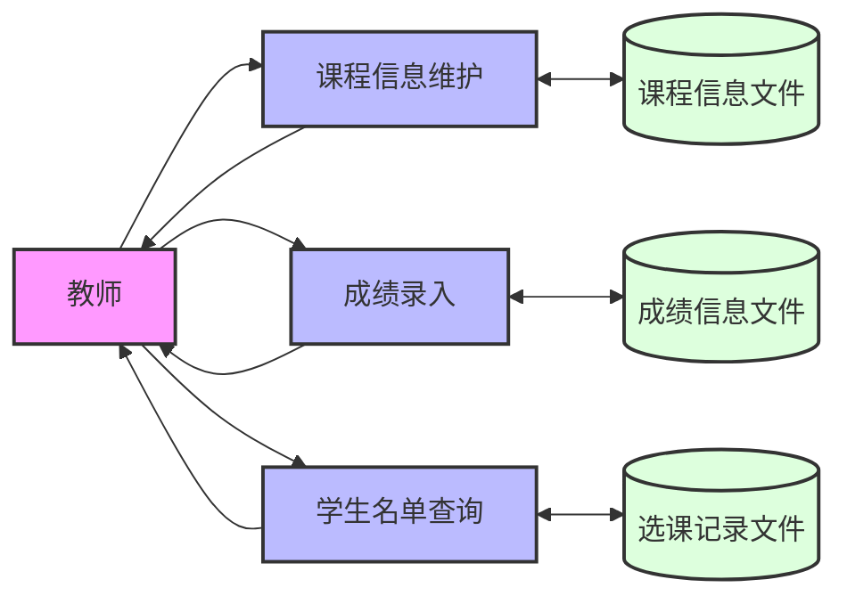
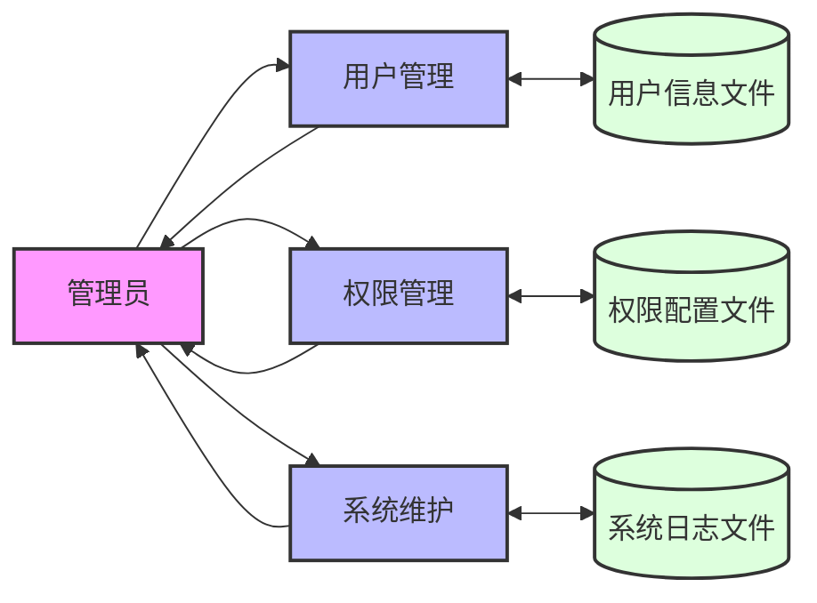

# 学生选课管理系统数据流图（可视化版本）

## 0. 顶层数据流图（环境图）

## 1. 一层数据流图

## 2. 二层数据流图

### 2.1 选课管理子系统

### 2.2 课程管理子系统

### 2.3 系统管理子系统

## 图例说明

- 粉色方框：外部实体（学生、教师、管理员）
- 蓝色方框：处理过程
- 绿色圆柱：数据存储
- 箭头：数据流向
  - 单向箭头（→）表示单向数据流
  - 双向箭头（↔）表示双向数据交换 