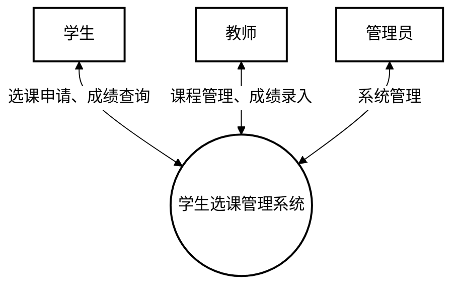
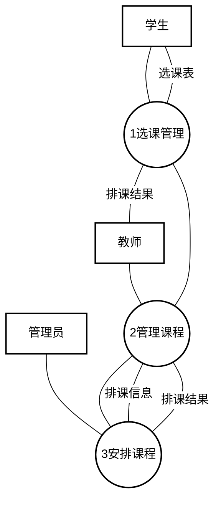
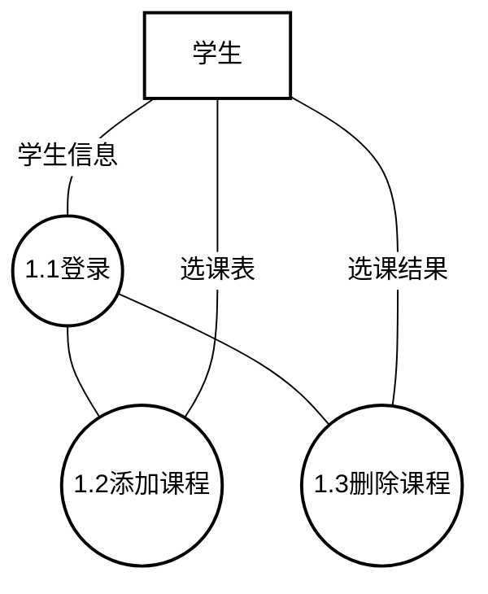
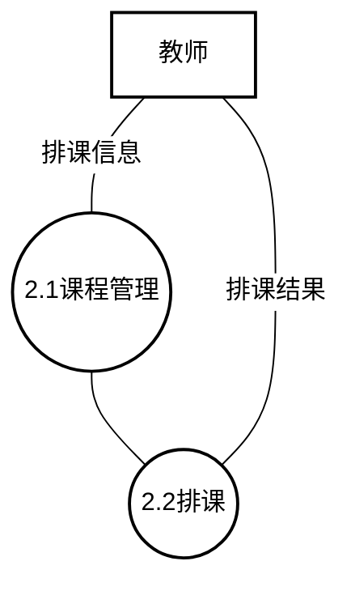
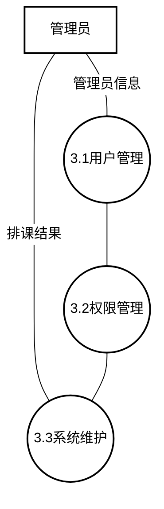
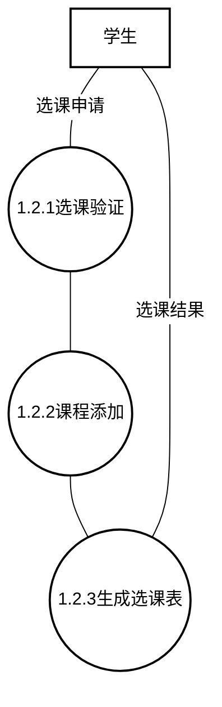

# 学生选课管理系统数据流图（白底黑字版）

## 0. 顶层数据流图（环境图）

## 1. 一层数据流图

## 2. 二层数据流图

### 2.1 选课管理子系统

### 2.2 课程管理子系统

### 2.3 系统管理子系统

## 3. 三层数据流图

### 3.1 选课申请处理详细流程

## 图例说明

- 矩形框: 外部实体（学生、教师、管理员）
- 圆形: 处理过程/功能模块
- 单线箭头: 数据流向
- 文本标签: 传递的数据内容 