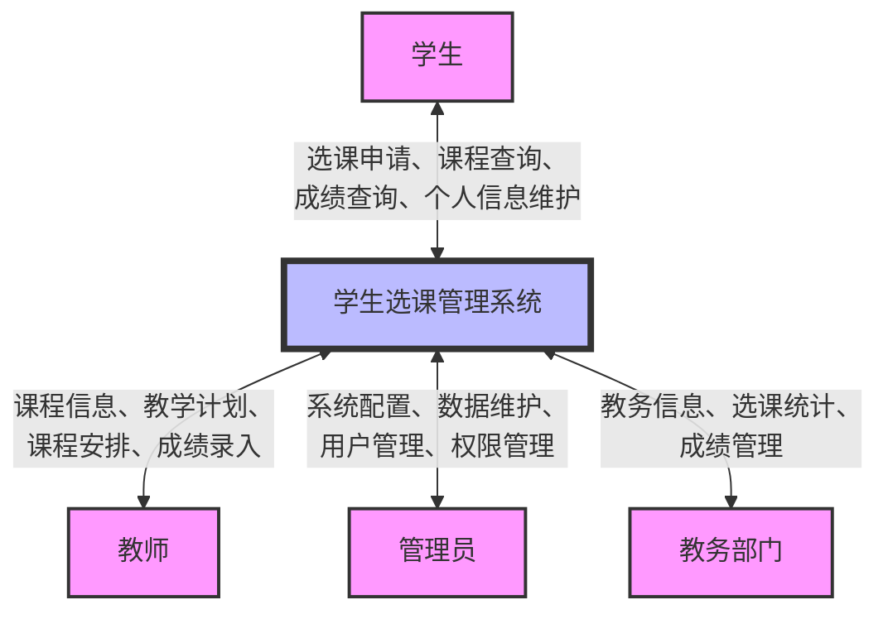
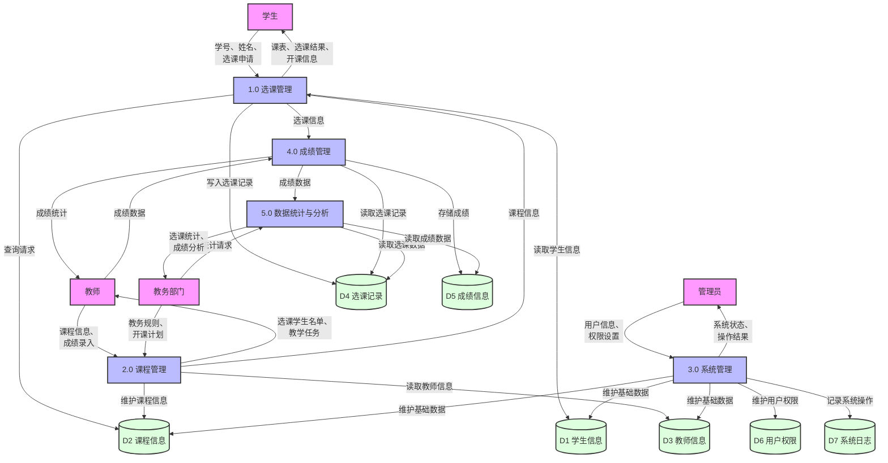
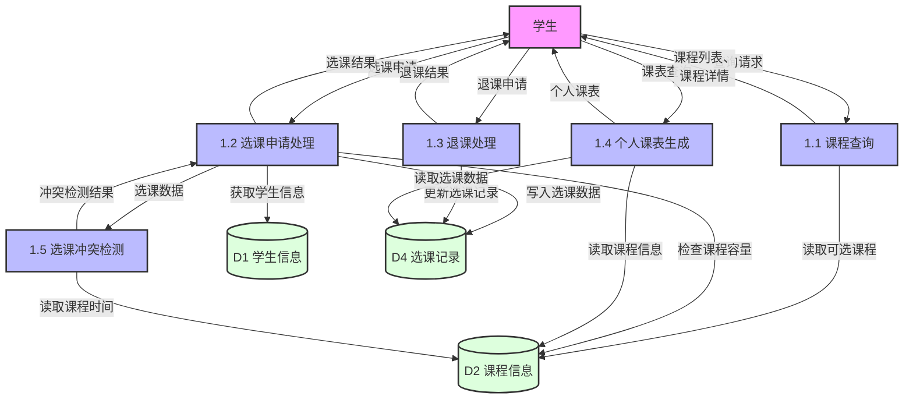
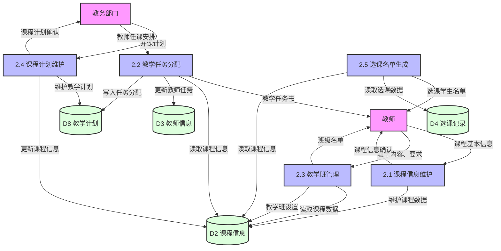
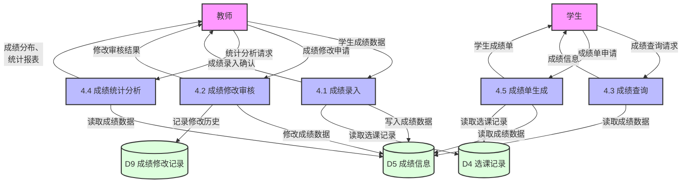
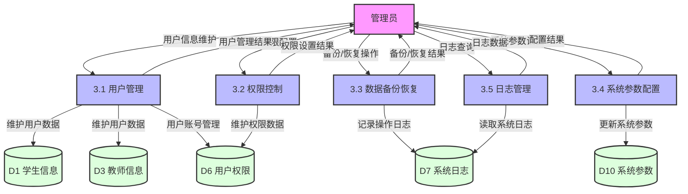
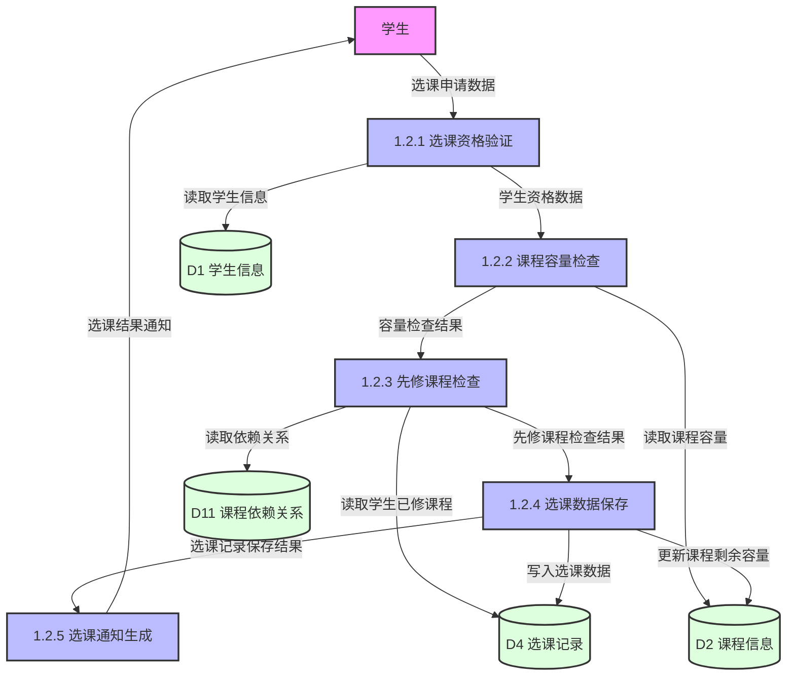
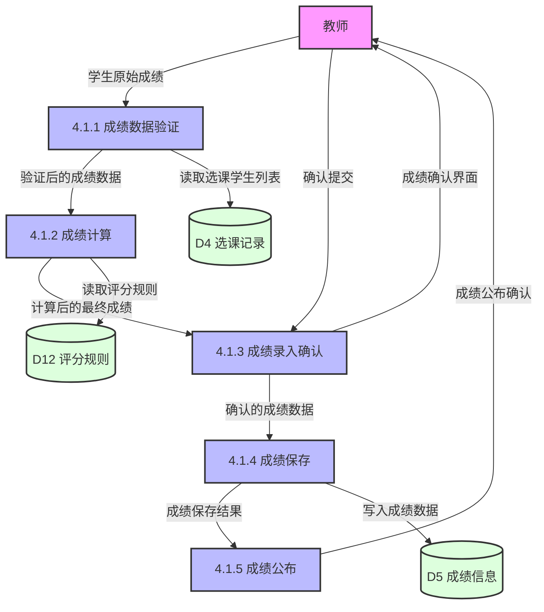

# 学生选课管理系统数据流图（详细版）

## 0. 顶层数据流图（环境图）

## 1. 一层数据流图

## 2. 二层数据流图

### 2.1 选课管理子系统（Process 1.0 分解）

### 2.2 课程管理子系统（Process 2.0 分解）

### 2.3 成绩管理子系统（Process 4.0 分解）

### 2.4 系统管理子系统（Process 3.0 分解）

## 3. 三层数据流图（部分关键流程）

### 3.1 选课申请处理流程（Process 1.2 分解）

### 3.2 成绩录入流程（Process 4.1 分解）

## 数据存储说明

| 编号 | 名称 | 内容说明 |
|------|------|---------|
| D1 | 学生信息 | 学号、姓名、性别、院系、专业、年级、联系方式等基本信息 |
| D2 | 课程信息 | 课程编号、名称、学分、学时、教师、上课时间地点、课程容量、课程介绍等 |
| D3 | 教师信息 | 教师编号、姓名、职称、所属院系、联系方式等基本信息 |
| D4 | 选课记录 | 学生学号、课程编号、选课时间、选课状态、教学班等 |
| D5 | 成绩信息 | 学生学号、课程编号、学期、成绩、绩点、评语等 |
| D6 | 用户权限 | 用户账号、密码、角色、权限等级、权限范围等 |
| D7 | 系统日志 | 操作时间、操作用户、操作类型、操作内容、IP地址等 |
| D8 | 教学计划 | 专业培养方案、课程计划、学期安排、必修/选修要求等 |
| D9 | 成绩修改记录 | 修改前成绩、修改后成绩、修改原因、修改时间、审核状态等 |
| D10 | 系统参数 | 选课开始/结束时间、成绩录入开放时间、学期信息等系统参数 |
| D11 | 课程依赖关系 | 课程之间的先修、后续关系定义 |
| D12 | 评分规则 | 平时成绩比例、考试成绩比例、考勤成绩比例等规则定义 |

## 主要数据流说明

### 外部实体与系统的数据流

1. **学生 ↔ 系统**:
   - 学生 → 系统: 选课申请、退课申请、课程查询请求、成绩查询请求、个人信息更新
   - 系统 → 学生: 课程信息列表、个人课表、选课结果通知、课程冲突提示、成绩单

2. **教师 ↔ 系统**:
   - 教师 → 系统: 课程信息维护、教学任务接收、成绩录入、成绩修改申请
   - 系统 → 教师: 选课学生名单、教学班信息、课程统计数据、成绩分析报表

3. **管理员 ↔ 系统**:
   - 管理员 → 系统: 用户管理请求、权限配置、系统参数设置、数据维护操作
   - 系统 → 管理员: 系统运行状态、操作结果反馈、错误警告信息、统计报表

4. **教务部门 ↔ 系统**:
   - 教务部门 → 系统: 课程计划、教学任务分配、选课政策规定
   - 系统 → 教务部门: 选课统计结果、成绩统计分析、教学资源使用情况

### 系统内部数据流

1. **选课管理子系统**:
   - 课程查询 → 选课申请处理: 可选课程信息
   - 选课冲突检测 → 选课申请处理: 时间冲突检测结果
   - 选课申请处理 → 个人课表生成: 已选课程信息

2. **课程管理子系统**:
   - 课程计划维护 → 课程信息维护: 课程计划数据
   - 教学任务分配 → 教学班管理: 教师任课信息
   - 课程信息维护 → 选课名单生成: 课程基本信息

3. **成绩管理子系统**:
   - 成绩录入 → 成绩统计分析: 原始成绩数据
   - 成绩修改审核 → 成绩查询: 最新成绩信息
   - 成绩统计分析 → 成绩单生成: 成绩统计结果

4. **系统管理子系统**:
   - 用户管理 → 权限控制: 用户账号信息
   - 系统参数配置 → 各功能模块: 系统运行参数
   - 各功能模块 → 日志管理: 操作日志信息 